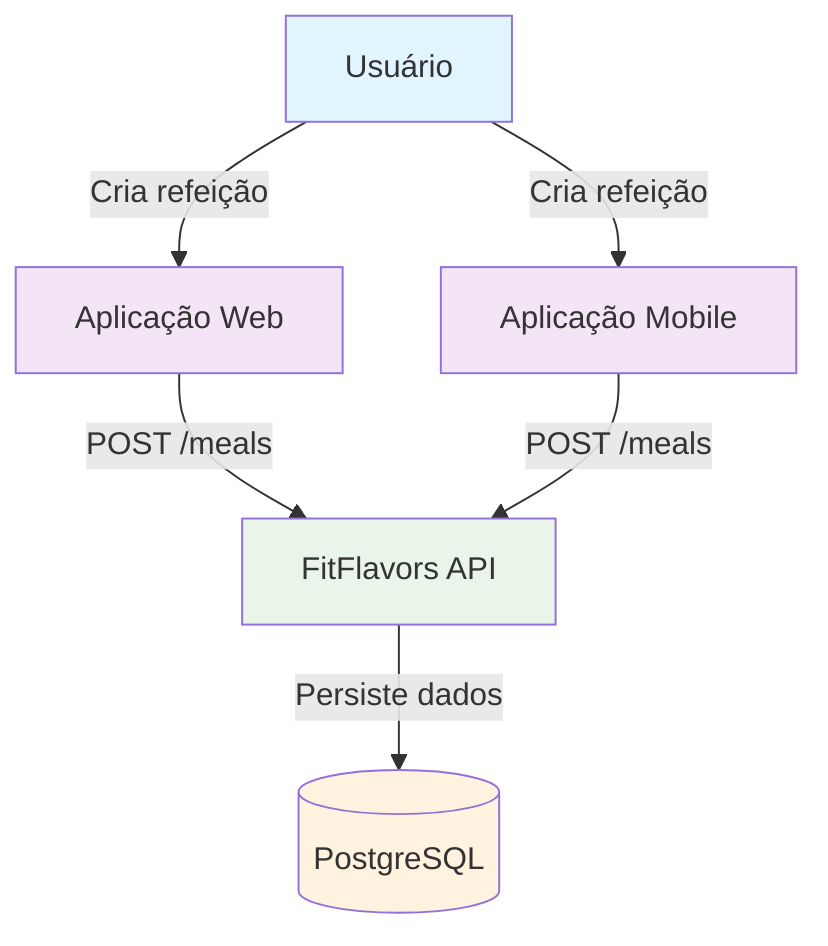
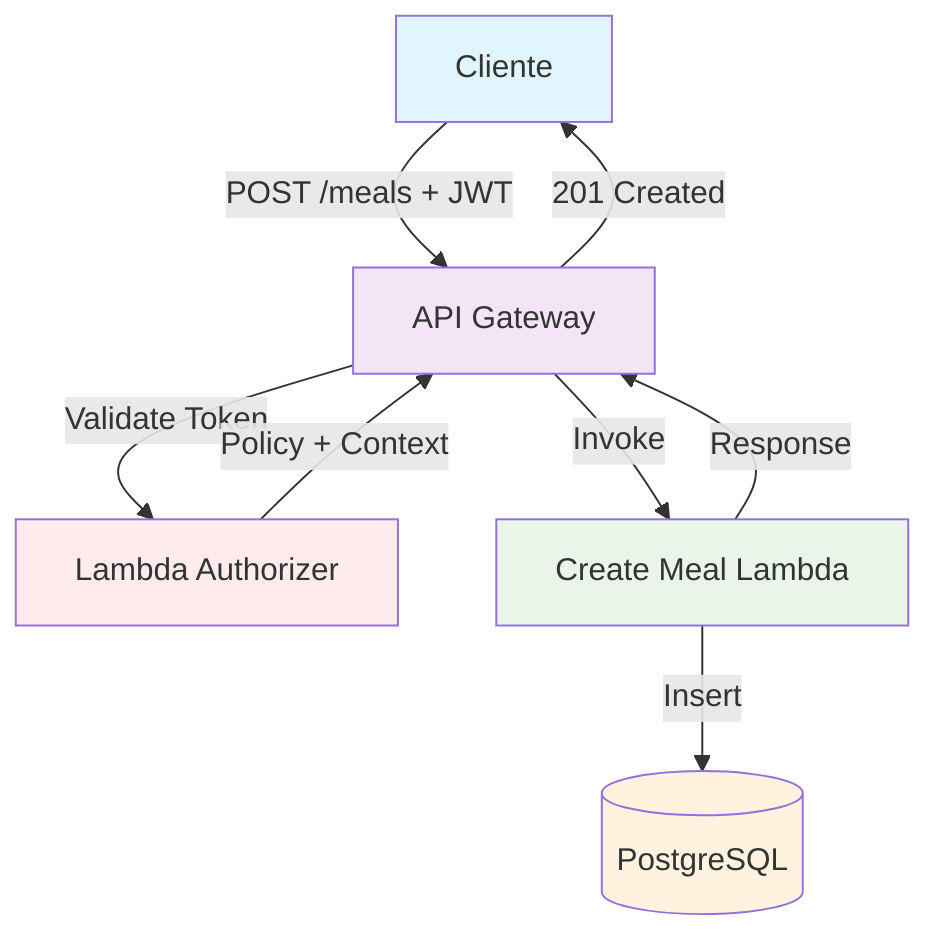
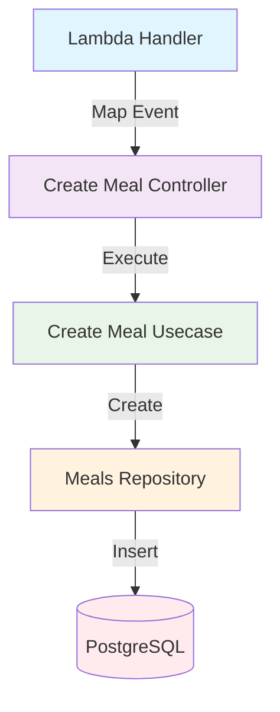
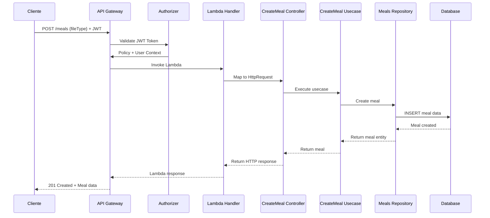

# C4 Model - Criar Refeição Endpoint

## 🎯 Context (Nível 1)



**Descrição:** Endpoint para criação de refeições através de upload de arquivos (áudio ou imagem). O sistema processa o arquivo enviado e extrai informações nutricionais, criando uma nova refeição no perfil do usuário autenticado.

## 🏗️ Container (Nível 2)



**Componentes:**

- **API Gateway**: Recebe requisições HTTP e valida autenticação
- **Lambda Authorizer**: Valida token JWT e autoriza acesso
- **Create Meal Lambda**: Processa criação de refeição e persiste dados
- **PostgreSQL**: Armazena dados da refeição criada

## 🔧 Component (Nível 3)



**Fluxo de Execução:**

1. **Lambda Handler** mapeia evento API Gateway para HttpRequest
2. **Create Meal Controller** recebe requisição e aplica validações
3. **Create Meal Usecase** executa lógica de negócio para criação
4. **Meals Repository** persiste dados da refeição no banco

## 💻 Code (Nível 4)

### **Estrutura de Arquivos**

```
src/
├── infra/functions/
│   └── meal.ts                              # Lambda Handler
├── domain/meals/controllers/
│   └── create-meal.controller.ts            # Controller
├── domain/meals/usecases/
│   └── create-meal.usecase.ts               # Use Case
├── domain/meals/repositories/
│   └── meals.repository.ts                  # Repository Interface
├── infra/db/drizzle/repositories/
│   └── drizzle-meals.repository.ts          # Repository Implementation
└── domain/meals/dtos/
    └── create-meal.dto.ts                   # Request/Response DTOs
```

### **Fluxo de Dados**



### **Validações**

```typescript
const schema = z.object({
  fileType: z.enum(['audio/m4a', 'image/jpeg']),
});
```

### **Request Body**

```typescript
{
  "fileType": "audio/m4a" | "image/jpeg"
}
```

### **Response de Sucesso**

```typescript
{
  "data": {
    "meal": {
      "id": "meal-123",
      "name": "Refeição da Manhã",
      "icon": "🍳",
      "userId": "user-456",
      "status": "uploading",
      "inputType": "audio",
      "inputFileKey": "meals/audio-123.m4a",
      "foods": []
    }
  }
}
```

### **Response de Erro**

```typescript
{
  "error": "ValidationError",
  "message": "Tipo de arquivo inválido"
}
```

### **Tratamento de Erros**

- **400 Bad Request**: Dados de validação inválidos
- **401 Unauthorized**: Token JWT inválido ou expirado
- **403 Forbidden**: Usuário sem permissão
- **500 Internal Server Error**: Erro interno do servidor

## 📊 Métricas e Monitoramento

### **Métricas de Sucesso**

- Taxa de criação de refeições bem-sucedida
- Tempo de resposta do endpoint
- Uso de memória da Lambda
- Número de refeições criadas por usuário

### **Métricas de Erro**

- Taxa de validação falhada
- Taxa de erros de persistência
- Erros de banco de dados
- Falhas de processamento de arquivo

### **Métricas de Segurança**

- Tentativas de acesso não autorizado
- Taxa de tokens inválidos
- Tentativas de upload de arquivos não suportados

### **Logs Importantes**

- Tentativas de criação de refeição (sucesso/falha)
- Erros de validação de tipo de arquivo
- Problemas de conectividade com banco
- Uploads de arquivos suspeitos

## 🔒 Considerações de Segurança

- **Validação rigorosa** de tipos de arquivo permitidos
- **Autenticação obrigatória** via JWT
- **Autorização** baseada no usuário autenticado
- **Rate limiting** para prevenir abuso de upload
- **Logs de auditoria** para criação de refeições
- **Validação de tamanho** de arquivo (futuro)

## 🚀 Melhorias Futuras

1. **Validação de tamanho de arquivo** para prevenir uploads excessivos
2. **Processamento assíncrono** de arquivos grandes
3. **Compressão de imagens** antes do armazenamento
4. **Integração com IA** para análise nutricional automática
5. **Notificações em tempo real** do status de processamento

## 📝 Checklist de Implementação

### **Desenvolvimento**

- [x] Criar Lambda Handler
- [x] Implementar Controller
- [x] Implementar Use Case
- [x] Criar DTOs (Request/Response)
- [x] Implementar validações
- [x] Adicionar tratamento de erros

### **Testes**

- [ ] Testes unitários para Use Case
- [ ] Testes de integração para Controller
- [ ] Testes de validação de tipo de arquivo
- [ ] Testes de tratamento de erros

### **Deploy**

- [x] Configurar no serverless.yml
- [x] Configurar autorização JWT
- [x] Configurar variáveis de ambiente
- [ ] Testar em ambiente de desenvolvimento

### **Monitoramento**

- [ ] Configurar métricas de CloudWatch
- [ ] Configurar alertas de erro
- [ ] Implementar logs estruturados
- [ ] Documentar métricas de negócio

---

**Nota:** Este endpoint está implementado e funcional, permitindo a criação de refeições através de upload de arquivos de áudio ou imagem.
