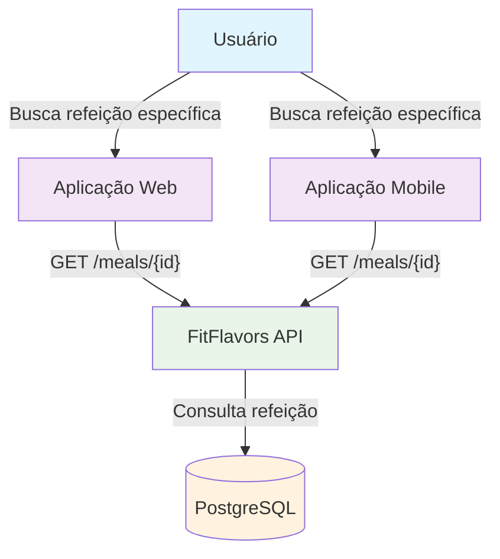
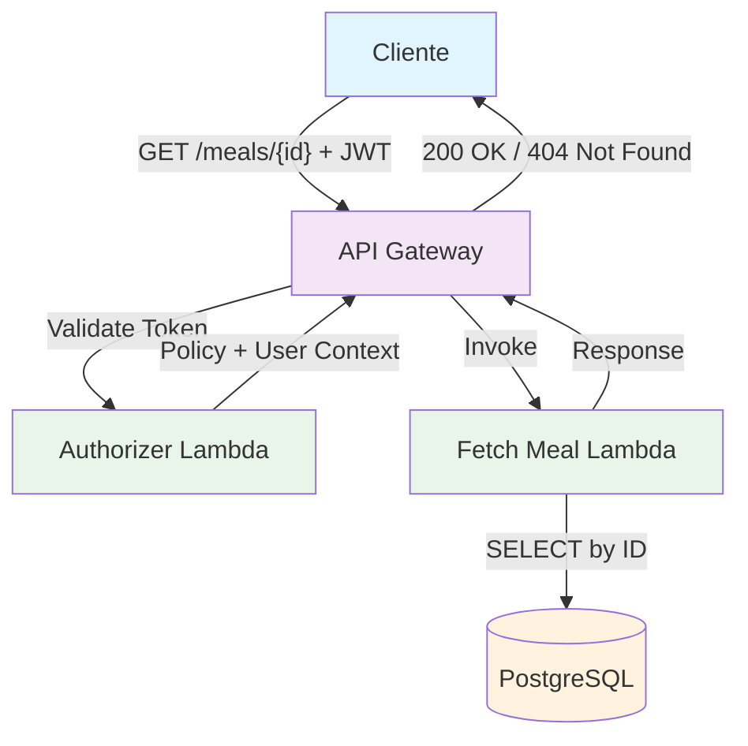
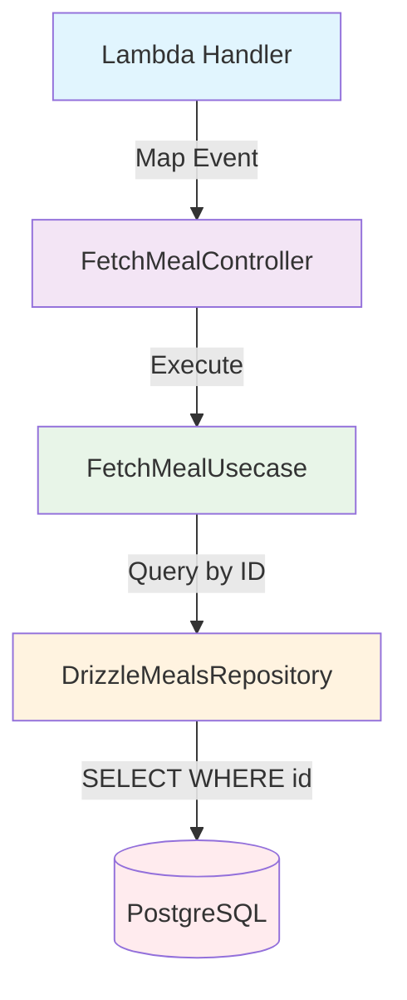
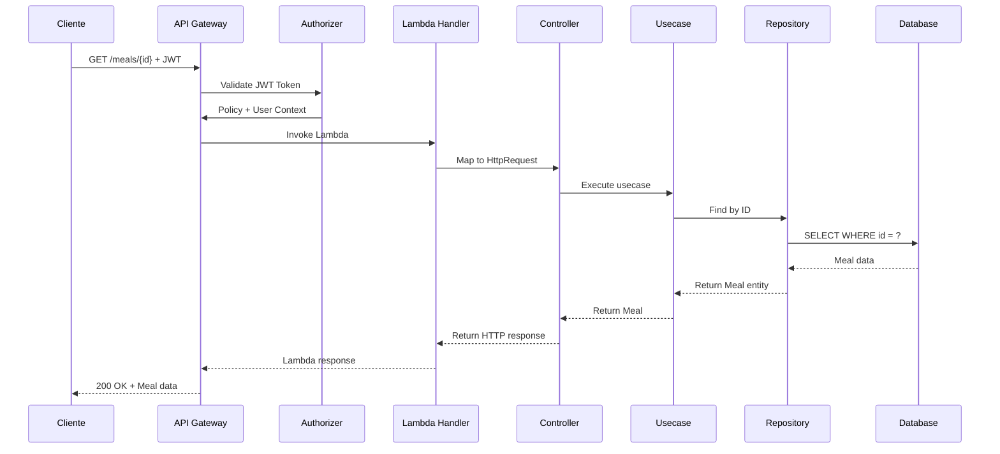

# C4 Model - Fetch Meal Endpoint

## 🎯 Context (Nível 1)



**Descrição:** Endpoint que permite buscar uma refeição específica pelo seu ID. O usuário pode acessar os detalhes completos de uma refeição que foi previamente cadastrada no sistema, incluindo informações sobre alimentos, status de processamento e metadados.

## 🏗️ Container (Nível 2)



**Componentes:**

- **API Gateway**: Recebe requisições HTTP GET e roteia para Lambda
- **Authorizer Lambda**: Valida token JWT e extrai contexto do usuário
- **Fetch Meal Lambda**: Busca refeição específica no banco de dados
- **PostgreSQL**: Armazena dados das refeições e executa consulta por ID

## 🔧 Component (Nível 3)



**Fluxo de Execução:**

1. **Lambda Handler** mapeia evento API Gateway para HttpRequest
2. **Controller** recebe requisição e valida parâmetros (ID)
3. **Usecase** executa lógica de negócio e valida propriedade da refeição
4. **Repository** consulta refeição por ID no banco de dados

## 💻 Code (Nível 4)

### **Estrutura de Arquivos**

```
src/
├── infra/functions/
│   └── fetch-meal.ts                    # Lambda Handler
├── domain/meals/controllers/
│   └── fetch-meal.controller.ts         # Controller
├── domain/meals/usecases/
│   └── fetch-meal.usecase.ts            # Use Case
├── domain/meals/repositories/
│   └── meals.repository.ts              # Repository Interface
├── infra/db/drizzle/repositories/
│   └── drizzle-meals.repository.ts      # Repository Implementation
└── domain/meals/dtos/
    └── fetch-meal.dto.ts                # Request/Response DTOs
```

### **Fluxo de Dados**



### **Validações**

```typescript
const fetchMealSchema = z.object({
  id: z.string().uuid('ID deve ser um UUID válido'),
});
```

### **Request**

```http
GET /meals/{id}
Authorization: Bearer <jwt-token>
```

**Path Parameters:**

- `id` (string, required): UUID da refeição a ser buscada

### **Response de Sucesso (200 OK)**

```typescript
{
  "meal": {
    "id": "550e8400-e29b-41d4-a716-446655440000",
    "name": "Café da manhã",
    "icon": "🥐",
    "status": "success",
    "inputType": "picture",
    "inputFileKey": "meals/user123/breakfast.jpg",
    "foods": [
      {
        "name": "Pão integral",
        "calories": 80,
        "quantity": 1
      }
    ],
    "createdAt": "2024-01-15T08:30:00.000Z",
    "updatedAt": "2024-01-15T08:30:00.000Z"
  }
}
```

### **Response de Erro**

```typescript
// 404 Not Found - Refeição não encontrada
{
  "error": "Not Found",
  "message": "Refeição não encontrada"
}

// 400 Bad Request - ID inválido
{
  "error": "Validation Error",
  "message": "ID deve ser um UUID válido"
}

// 401 Unauthorized - Token inválido
{
  "error": "Unauthorized",
  "message": "Token inválido ou expirado"
}
```

### **Tratamento de Erros**

- **400 Bad Request**: ID não é um UUID válido
- **401 Unauthorized**: Token JWT inválido ou expirado
- **404 Not Found**: Refeição não encontrada ou não pertence ao usuário
- **500 Internal Server Error**: Erro interno do servidor

## 📊 Métricas e Monitoramento

### **Métricas de Sucesso**

- Taxa de busca de refeição bem-sucedida
- Tempo de resposta do endpoint
- Uso de memória da Lambda
- Taxa de cache hit (se implementado)

### **Métricas de Erro**

- Taxa de validação falhada (ID inválido)
- Taxa de refeição não encontrada
- Erros de banco de dados
- Timeouts de consulta

### **Métricas de Segurança**

- Tentativas de acesso não autorizado
- Taxa de tokens inválidos
- Tentativas de acesso a refeições de outros usuários

### **Logs Importantes**

- Tentativas de busca de refeição (sucesso/falha)
- Erros de validação de ID
- Tentativas de acesso não autorizado
- Problemas de conectividade com banco

## 🔒 Considerações de Segurança

- **Validação rigorosa** de UUID no parâmetro ID
- **Autenticação obrigatória** via JWT
- **Autorização** - usuário só pode buscar suas próprias refeições
- **Rate limiting** para prevenir abuso
- **Logs de auditoria** para acessos a refeições
- **Não exposição** de dados sensíveis de outros usuários

## 🚀 Melhorias Futuras

1. **Cache Redis** para refeições frequentemente acessadas
2. **Paginação** para refeições com muitos alimentos
3. **Filtros avançados** por data, status, tipo de entrada
4. **Compressão** de resposta para refeições grandes
5. **Métricas de negócio** (refeições mais acessadas, etc.)

## 📝 Checklist de Implementação

### **Desenvolvimento**

- [x] Criar Lambda Handler
- [x] Implementar Controller
- [x] Implementar Use Case
- [x] Criar DTOs (Request/Response)
- [x] Implementar validações
- [x] Adicionar tratamento de erros

### **Testes**

- [ ] Testes unitários para Use Case
- [ ] Testes de integração para Controller
- [ ] Testes de validação de UUID
- [ ] Testes de autorização
- [ ] Testes de tratamento de erros

### **Deploy**

- [x] Configurar no serverless.yml
- [x] Configurar autorização
- [x] Configurar variáveis de ambiente
- [ ] Testar em ambiente de desenvolvimento

### **Monitoramento**

- [ ] Configurar métricas de CloudWatch
- [ ] Configurar alertas para erros 404
- [ ] Implementar logs estruturados
- [ ] Documentar métricas de negócio

---

**Nota:** Este endpoint é essencial para permitir que usuários visualizem detalhes específicos de suas refeições, sendo fundamental para a experiência do usuário na aplicação.
