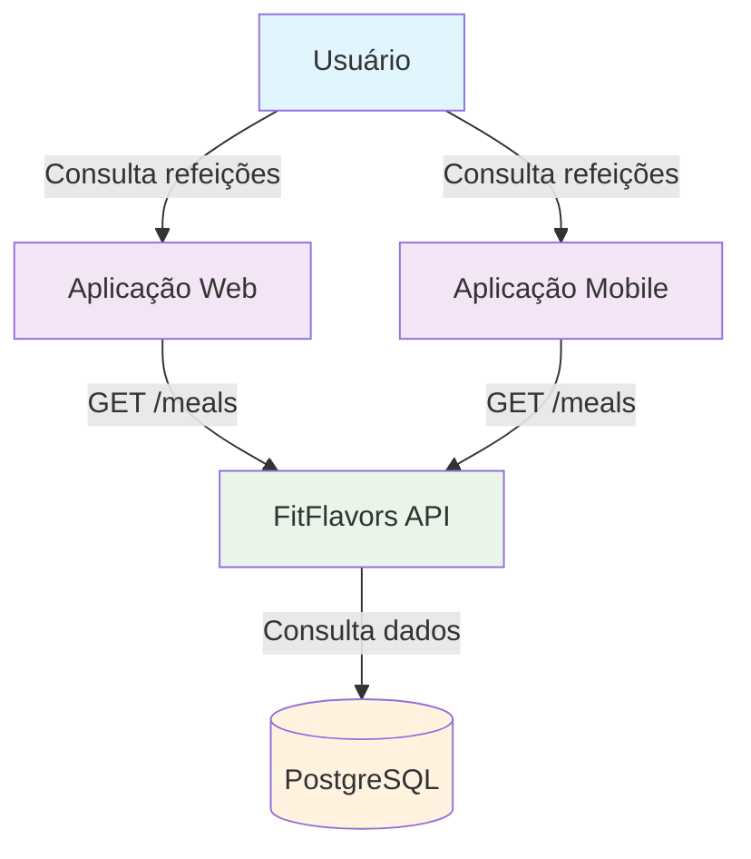
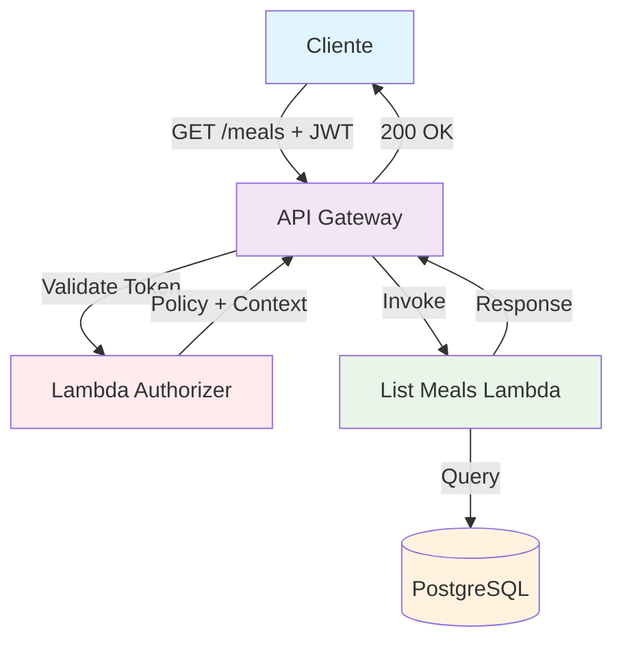
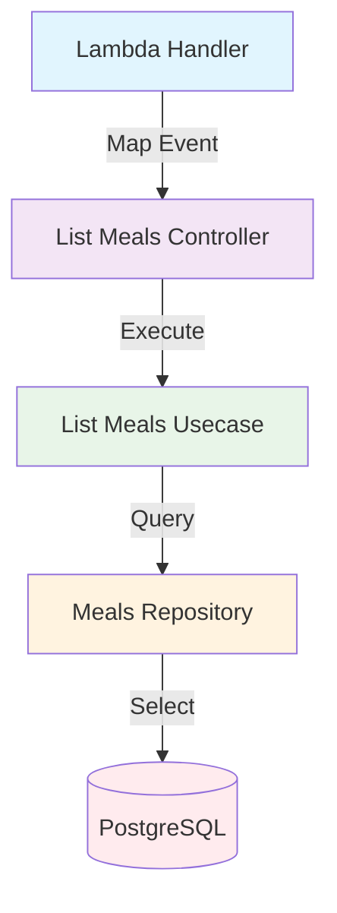
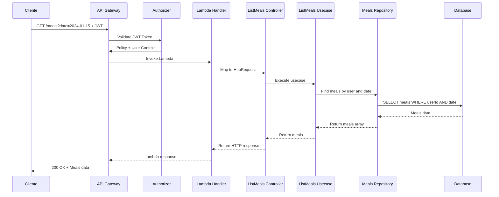

# C4 Model - Listar Refeições Endpoint

## 🎯 Context (Nível 1)



**Descrição:** Endpoint para listar refeições do usuário autenticado, com filtro por data. Permite visualizar o histórico de refeições cadastradas, incluindo status de processamento e informações nutricionais extraídas.

## 🏗️ Container (Nível 2)



**Componentes:**

- **API Gateway**: Recebe requisições HTTP e valida autenticação
- **Lambda Authorizer**: Valida token JWT e autoriza acesso
- **List Meals Lambda**: Consulta refeições do usuário no banco
- **PostgreSQL**: Armazena e retorna dados das refeições

## 🔧 Component (Nível 3)



**Fluxo de Execução:**

1. **Lambda Handler** mapeia evento API Gateway para HttpRequest
2. **List Meals Controller** recebe requisição e aplica validações
3. **List Meals Usecase** executa lógica de negócio para consulta
4. **Meals Repository** consulta refeições no banco de dados

## 💻 Code (Nível 4)

### **Estrutura de Arquivos**

```
src/
├── infra/functions/
│   └── list-meals.ts                        # Lambda Handler
├── domain/meals/controllers/
│   └── list-meals.controller.ts             # Controller
├── domain/meals/usecases/
│   └── list-meals.usecase.ts                # Use Case
├── domain/meals/repositories/
│   └── meals.repository.ts                  # Repository Interface
├── infra/db/drizzle/repositories/
│   └── drizzle-meals.repository.ts          # Repository Implementation
└── domain/meals/dtos/
    └── list-meals.dto.ts                    # Request/Response DTOs
```

### **Fluxo de Dados**



### **Validações**

```typescript
const listMealsSchema = z.object({
  date: z.iso.date(),
});
```

### **Query Parameters**

```typescript
{
  "date": "2024-01-15" // ISO date format
}
```

### **Response de Sucesso**

```typescript
{
  "data": {
    "meals": [
      {
        "id": "meal-123",
        "name": "Café da Manhã",
        "icon": "🍳",
        "userId": "user-456",
        "status": "success",
        "inputType": "audio",
        "inputFileKey": "meals/audio-123.m4a",
        "foods": [
          {
            "name": "Ovos",
            "calories": 140,
            "protein": 12
          }
        ],
        "createdAt": "2024-01-15T08:30:00Z"
      }
    ]
  }
}
```

### **Response de Erro**

```typescript
{
  "error": "ValidationError",
  "message": "Data inválida. Use o formato ISO (YYYY-MM-DD)"
}
```

### **Tratamento de Erros**

- **400 Bad Request**: Parâmetros de consulta inválidos
- **401 Unauthorized**: Token JWT inválido ou expirado
- **403 Forbidden**: Usuário sem permissão
- **500 Internal Server Error**: Erro interno do servidor

## 📊 Métricas e Monitoramento

### **Métricas de Sucesso**

- Taxa de consulta de refeições bem-sucedida
- Tempo de resposta do endpoint
- Uso de memória da Lambda
- Número de refeições retornadas por consulta

### **Métricas de Erro**

- Taxa de validação de data falhada
- Taxa de erros de consulta ao banco
- Erros de banco de dados
- Timeouts de consulta

### **Métricas de Segurança**

- Tentativas de acesso não autorizado
- Taxa de tokens inválidos
- Consultas suspeitas (muitas requisições)

### **Logs Importantes**

- Tentativas de consulta de refeições (sucesso/falha)
- Erros de validação de data
- Problemas de conectividade com banco
- Consultas por usuário e data

## 🔒 Considerações de Segurança

- **Validação rigorosa** de formato de data
- **Autenticação obrigatória** via JWT
- **Autorização** baseada no usuário autenticado
- **Filtro por usuário** para evitar vazamento de dados
- **Rate limiting** para prevenir abuso de consultas
- **Logs de auditoria** para consultas de refeições

## 🚀 Melhorias Futuras

1. **Paginação** para listas grandes de refeições
2. **Filtros adicionais** (status, tipo de entrada)
3. **Ordenação** por data de criação
4. **Cache** para consultas frequentes
5. **Exportação** de dados em CSV/PDF

## 📝 Checklist de Implementação

### **Desenvolvimento**

- [x] Criar Lambda Handler
- [x] Implementar Controller
- [x] Implementar Use Case
- [x] Criar DTOs (Request/Response)
- [x] Implementar validações
- [x] Adicionar tratamento de erros

### **Testes**

- [ ] Testes unitários para Use Case
- [ ] Testes de integração para Controller
- [ ] Testes de validação de data
- [ ] Testes de tratamento de erros

### **Deploy**

- [x] Configurar no serverless.yml
- [x] Configurar autorização JWT
- [x] Configurar variáveis de ambiente
- [ ] Testar em ambiente de desenvolvimento

### **Monitoramento**

- [ ] Configurar métricas de CloudWatch
- [ ] Configurar alertas de erro
- [ ] Implementar logs estruturados
- [ ] Documentar métricas de negócio

---

**Nota:** Este endpoint está implementado e funcional, permitindo a consulta de refeições do usuário autenticado com filtro por data.
