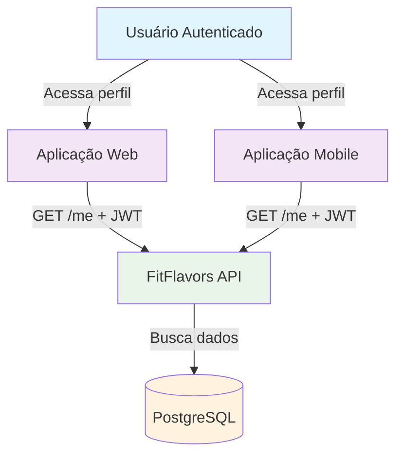
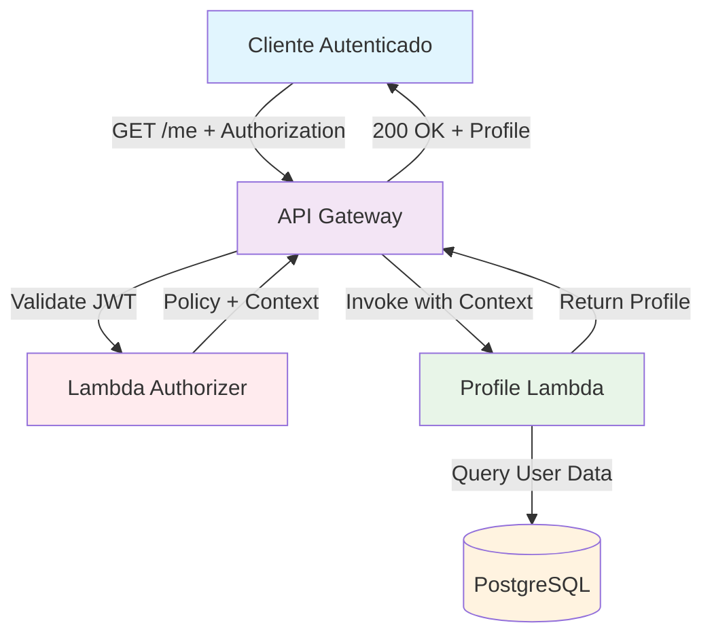
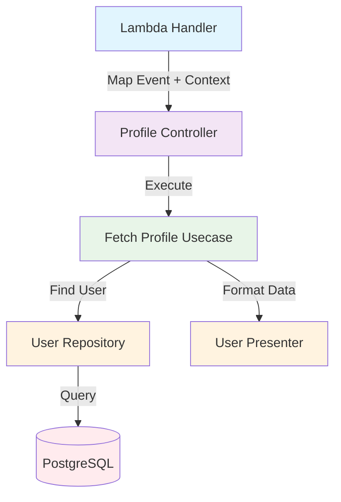
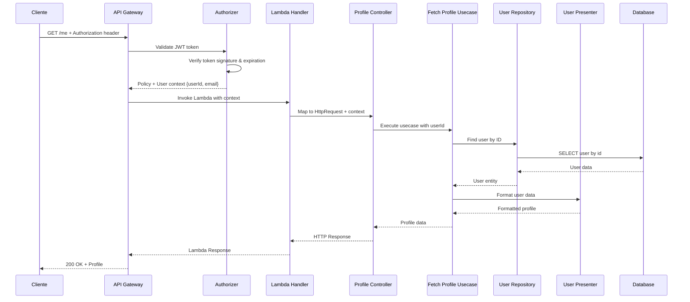
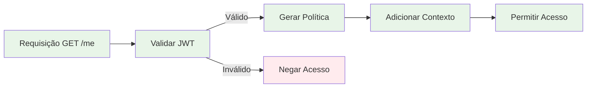

# C4 Model - Profile Endpoint (GET /me)

## 🎯 Context (Nível 1)



**Descrição:** O endpoint de Profile permite que usuários autenticados acessem seus dados pessoais e de fitness, incluindo informações calculadas como metas nutricionais.

## 🏗️ Container (Nível 2)



**Componentes:**

- **API Gateway**: Recebe requisições HTTP e valida JWT
- **Lambda Authorizer**: Valida token JWT e retorna contexto do usuário
- **Profile Lambda**: Busca e retorna dados do perfil do usuário
- **PostgreSQL**: Armazena dados do usuário

## 🔧 Component (Nível 3)



**Fluxo de Execução:**

1. **Lambda Handler** mapeia evento API Gateway para HttpRequest
2. **Profile Controller** recebe requisição com contexto do usuário
3. **Fetch Profile Usecase** executa lógica de busca de perfil
4. **User Repository** busca dados do usuário por ID
5. **User Presenter** formata dados para resposta

## 💻 Code (Nível 4)

### **Estrutura de Arquivos**

```
src/
├── infra/functions/
│   ├── authorizer.ts                    # Lambda Authorizer
│   └── profile.ts                       # Lambda Handler
├── domain/users/controllers/
│   └── profile.controller.ts            # Controller
├── domain/users/usecases/
│   └── fetch-profile.usecase.ts         # Use Case
├── domain/users/repositories/
│   └── user.repository.ts               # Repository Interface
├── infra/db/drizzle/repositories/
│   └── drizzle-user.repository.ts       # Repository Implementation
├── domain/users/presenters/
│   └── user.presenter.ts                # Data Presenter
└── domain/users/dtos/
    └── fetch-profile-response.dto.ts    # Response DTO
```

### **Fluxo de Dados**



### **Validação de Autenticação**

```typescript
// No Lambda Authorizer
const payload = jwtProvider.verifyToken(cleanToken);
if (!payload) {
  throw new Error('Token inválido');
}

return {
  principalId: payload.sub,
  context: {
    userId: payload.sub,
    email: payload.email,
  },
};
```

### **Resposta de Sucesso**

```typescript
{
  "profile": {
    "id": "user-123",
    "name": "João Silva",
    "email": "joao@example.com",
    "gender": "male",
    "goal": "lose",
    "birthDate": "1990-01-01",
    "height": 175,
    "weight": 80,
    "activityLevel": 3,
    "createdAt": "2024-01-01T00:00:00Z",
    "updatedAt": "2024-01-01T00:00:00Z"
  }
}
```

### **Tratamento de Erros**

- **401 Unauthorized**: Token JWT inválido ou expirado
- **403 Forbidden**: Token válido mas sem permissão
- **404 Not Found**: Usuário não encontrado
- **500 Internal Server Error**: Erro interno do servidor

## 📊 Métricas e Monitoramento

### **Métricas de Sucesso**

- Taxa de acesso ao perfil bem-sucedido
- Tempo de resposta do endpoint
- Tempo de validação do JWT
- Uso de memória da Lambda

### **Métricas de Erro**

- Taxa de tokens inválidos
- Taxa de usuários não encontrados
- Erros de banco de dados
- Timeouts do authorizer

### **Métricas de Segurança**

- Tentativas de acesso com token inválido
- Taxa de tokens expirados
- Acessos negados pelo authorizer

### **Logs Importantes**

- Tentativas de acesso ao perfil
- Validação de JWT (sucesso/falha)
- Erros de busca de usuário
- Problemas de conectividade com banco

## 🔒 Considerações de Segurança

- **Validação rigorosa** de JWT no API Gateway
- **Contexto do usuário** passado pelo authorizer
- **Isolamento de dados** por usuário
- **Logs de auditoria** para acessos ao perfil
- **Rate limiting** para prevenir abuso
- **Não exposição** de dados sensíveis

## 🚀 Melhorias Futuras

1. **Cache** de dados do perfil
2. **Paginação** para dados históricos
3. **Versionamento** de API
4. **Métricas de negócio** (frequência de acesso)
5. **Logs de auditoria** mais detalhados
6. **Validação adicional** de permissões
7. **Rate limiting** por usuário
8. **Monitoramento** de acessos suspeitos

## 🔄 Fluxo de Autorização



## 📈 Performance

### **Otimizações Implementadas**

- Validação de JWT no API Gateway (cache de 300s)
- Consulta direta por ID (índice primário)
- Resposta mínima com dados essenciais

### **Métricas de Performance**

- Latência do authorizer: < 100ms
- Latência da Lambda: < 200ms
- Latência total: < 300ms
- Throughput: 1000+ req/s
