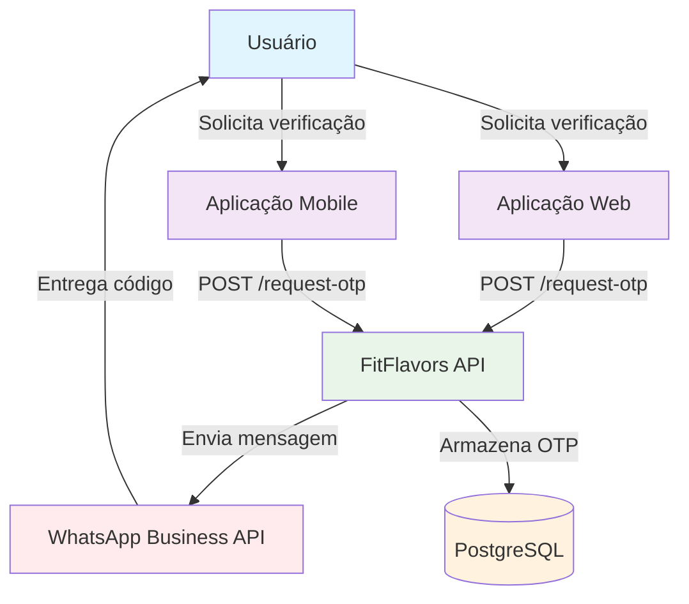
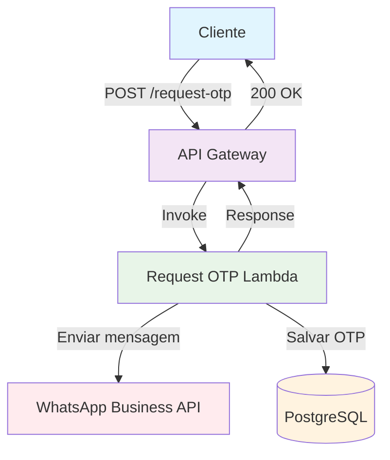
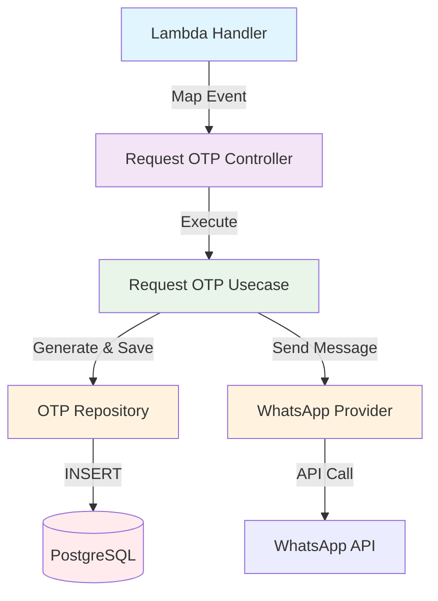
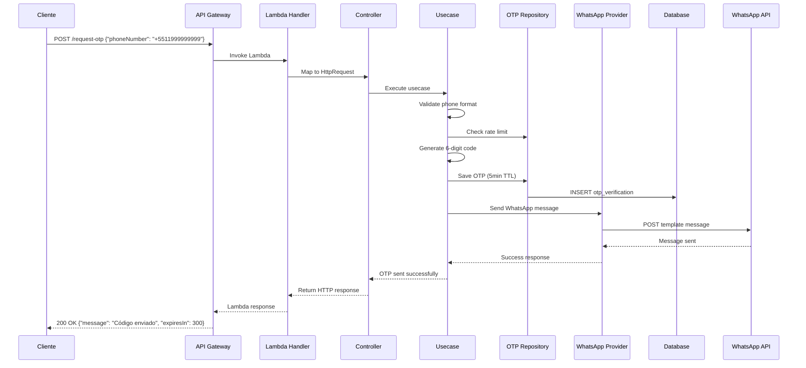

# C4 Model - Request OTP Endpoint

## 🎯 Context (Nível 1)



**Descrição:** Endpoint responsável por gerar e enviar códigos OTP via WhatsApp para validação de números de telefone durante o processo de cadastro ou autenticação de usuários.

## 🏗️ Container (Nível 2)



**Componentes:**

- **API Gateway**: Recebe requisições HTTP e roteia para Lambda
- **Request OTP Lambda**: Gera código OTP, envia via WhatsApp e persiste no banco
- **WhatsApp Business API**: Serviço externo para envio de mensagens
- **PostgreSQL**: Armazena códigos OTP com TTL de 5 minutos

## 🔧 Component (Nível 3)



**Fluxo de Execução:**

1. **Lambda Handler** mapeia evento API Gateway para HttpRequest
2. **Controller** recebe requisição e aplica validações de telefone
3. **Usecase** executa lógica: verifica rate limit, gera código, envia WhatsApp
4. **Repository** persiste código OTP com expiração de 5 minutos
5. **WhatsApp Provider** envia mensagem usando template aprovado

## 💻 Code (Nível 4)

### **Estrutura de Arquivos**

```
src/
├── infra/functions/
│   └── request-otp.ts                    # Lambda Handler
├── domain/users/controllers/
│   └── request-otp.controller.ts         # Controller
├── domain/users/usecases/
│   └── request-otp.usecase.ts            # Use Case
├── domain/users/repositories/
│   └── otp-verification.repository.ts    # Repository Interface
├── infra/db/drizzle/repositories/
│   └── drizzle-otp-verification.repository.ts # Repository Implementation
├── domain/users/providers/
│   └── whatsapp.provider.ts              # WhatsApp Provider Interface
├── infra/providers/
│   └── whatsapp-api.provider.ts          # WhatsApp Provider Implementation
└── domain/users/dtos/
    └── request-otp.dto.ts                # Request/Response DTOs
```

### **Fluxo de Dados**



### **Validações**

```typescript
const schema = z.object({
  phoneNumber: z
    .string()
    .regex(/^\+[1-9]\d{1,14}$/, 'Formato de telefone inválido')
    .min(8, 'Número muito curto')
    .max(17, 'Número muito longo'),
});
```

### **Request Body**

```typescript
{
  "phoneNumber": "+5511999999999"
}
```

### **Response de Sucesso**

```typescript
{
  "message": "Código enviado para WhatsApp",
  "expiresIn": 300
}
```

### **Response de Erro**

```typescript
// Validação inválida
{
  "error": "ValidationError",
  "message": "Formato de telefone inválido"
}

// Rate limit excedido
{
  "error": "RateLimitExceeded",
  "message": "Muitas tentativas. Tente novamente em 60 segundos",
  "retryAfter": 60
}

// Erro no WhatsApp API
{
  "error": "WhatsAppError",
  "message": "Falha ao enviar mensagem. Tente novamente."
}
```

### **Tratamento de Erros**

- **400 Bad Request**: Formato de telefone inválido
- **429 Too Many Requests**: Rate limit excedido (1 por minuto)
- **500 Internal Server Error**: Erro na integração WhatsApp ou banco
- **503 Service Unavailable**: WhatsApp API indisponível

## 📊 Métricas e Monitoramento

### **Métricas de Sucesso**

- Taxa de envio bem-sucedido (>95%)
- Tempo de resposta do endpoint (<3s)
- Taxa de entrega WhatsApp (>90%)
- Uso de memória da Lambda (<128MB)

### **Métricas de Erro**

- Taxa de validação falhada
- Rate limit hits por minuto
- Erros de integração WhatsApp
- Timeouts de banco de dados

### **Métricas de Segurança**

- Tentativas com números inválidos
- Padrões de rate limiting por IP
- Volumetria por número de telefone

### **Logs Importantes**

- Tentativas de envio OTP (sucesso/falha)
- Rate limit violations
- Erros de integração WhatsApp
- Códigos gerados (apenas últimos 2 dígitos para debug)

## 🔒 Considerações de Segurança

- **Validação rigorosa** do formato de telefone internacional
- **Rate limiting** de 1 request por minuto por número
- **Rate limiting** de 10 requests por minuto por IP
- **Logs de auditoria** para todas as tentativas
- **Não exposição** do código OTP nos logs
- **TTL automático** de códigos para limpeza
- **Sanitização** de input para prevenir injection

## 🚀 Melhorias Futuras

1. **Retry automático** para falhas temporárias do WhatsApp
2. **Fallback para SMS** quando WhatsApp falhar
3. **Analytics de entrega** via webhook WhatsApp
4. **Cache Redis** para rate limiting distribuído
5. **Geolocalização** para validação de números

## 📝 Checklist de Implementação

### **Desenvolvimento**

- [ ] Criar Lambda Handler
- [ ] Implementar Controller com validações
- [ ] Implementar Use Case com lógica de negócio
- [ ] Criar DTOs (Request/Response)
- [ ] Implementar WhatsApp Provider
- [ ] Implementar OTP Repository
- [ ] Adicionar tratamento de erros
- [ ] Implementar rate limiting

### **Testes**

- [ ] Testes unitários para Use Case
- [ ] Testes de integração para Controller
- [ ] Testes de validação de telefone
- [ ] Testes de rate limiting
- [ ] Mock do WhatsApp Provider
- [ ] Testes de tratamento de erros

### **Deploy**

- [ ] Configurar no serverless.yml
- [ ] Configurar variáveis de ambiente WhatsApp
- [ ] Configurar timeout da Lambda (30s)
- [ ] Testar em ambiente de desenvolvimento
- [ ] Configurar alertas CloudWatch

### **Monitoramento**

- [ ] Configurar métricas de CloudWatch
- [ ] Configurar alertas de erro e latência
- [ ] Implementar logs estruturados
- [ ] Dashboard para métricas de negócio
- [ ] Alertas para rate limit e falhas WhatsApp

---

**Nota:** Este endpoint é **público** (não requer autenticação) pois é usado antes do login/cadastro do usuário.
