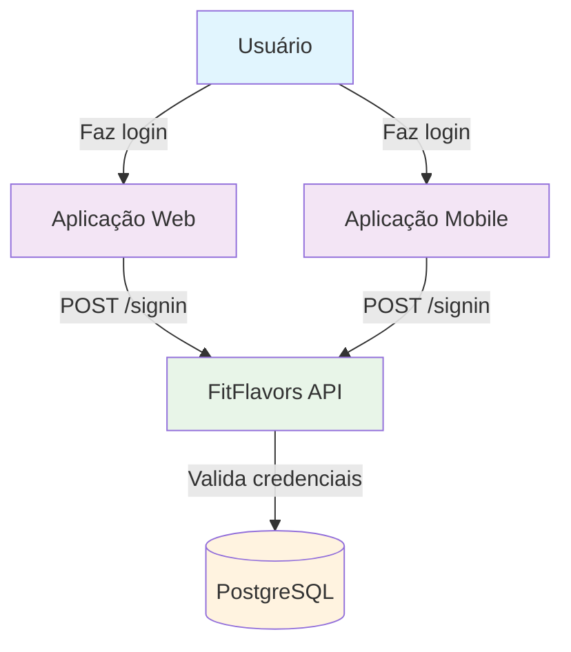
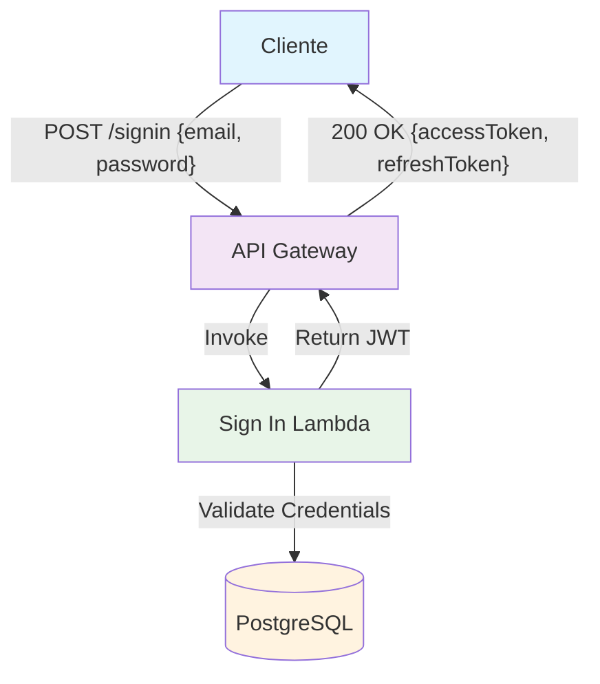
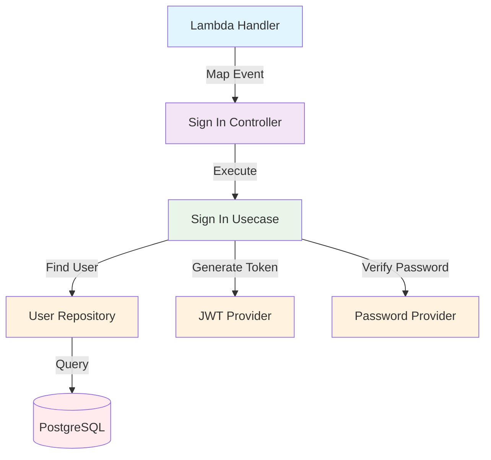
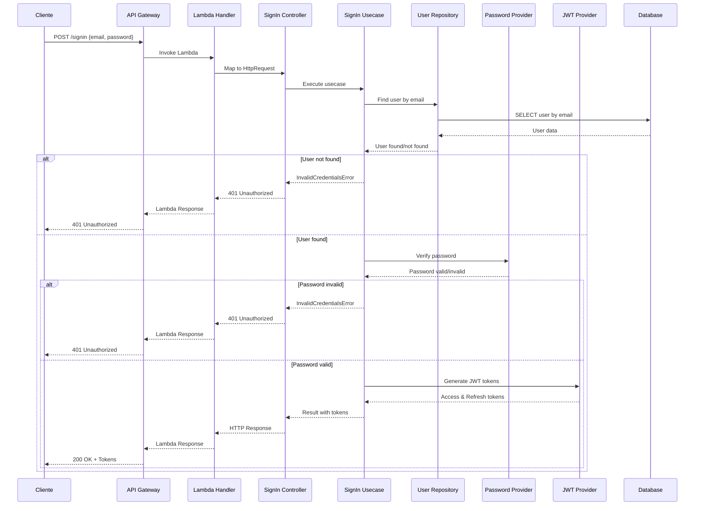

# C4 Model - Sign In Endpoint

## 🎯 Context (Nível 1)



**Descrição:** O endpoint de Sign In permite que usuários autentiquem-se na aplicação FitFlavors usando email e senha, recebendo tokens JWT para acesso aos recursos protegidos.

## 🏗️ Container (Nível 2)



**Componentes:**

- **API Gateway**: Recebe requisições HTTP e roteia para Lambda
- **Sign In Lambda**: Valida credenciais e gera tokens JWT
- **PostgreSQL**: Consulta dados do usuário para validação

## 🔧 Component (Nível 3)



**Fluxo de Execução:**

1. **Lambda Handler** mapeia evento API Gateway para HttpRequest
2. **Sign In Controller** recebe requisição com email e senha
3. **Sign In Usecase** executa lógica de autenticação
4. **User Repository** busca usuário por email
5. **Password Provider** verifica senha com hash armazenado
6. **JWT Provider** gera tokens de acesso e refresh

## 💻 Code (Nível 4)

### **Estrutura de Arquivos**

```
src/
├── infra/functions/signin.ts           # Lambda Handler
├── domain/users/controllers/
│   └── sign-in.controller.ts           # Controller
├── domain/users/usecases/
│   └── sign-in.usecase.ts              # Use Case
├── domain/users/repositories/
│   └── user.repository.ts              # Repository Interface
├── infra/db/drizzle/repositories/
│   └── drizzle-user.repository.ts      # Repository Implementation
├── infra/providers/
│   ├── jwt.provider.ts                 # JWT Provider
│   └── password.provider.ts            # Password Provider
└── domain/users/errors/
    └── invalid-credentials.error.ts    # Error Handling
```

### **Fluxo de Dados**



### **Validações**

```typescript
const schema = z.object({
  email: z.email(),
  password: z.string().min(8),
});
```

### **Resposta de Sucesso**

```typescript
{
  "accessToken": "eyJhbGciOiJIUzI1NiIsInR5cCI6IkpXVCJ9...",
  "refreshToken": "eyJhbGciOiJIUzI1NiIsInR5cCI6IkpXVCJ9..."
}
```

### **Resposta de Erro**

```typescript
{
  "error": "Invalid credentials",
  "message": "Email or password is incorrect"
}
```

### **Tratamento de Erros**

- **400 Bad Request**: Dados de validação inválidos
- **401 Unauthorized**: Credenciais inválidas
- **500 Internal Server Error**: Erro interno do servidor

## 📊 Métricas e Monitoramento

### **Métricas de Sucesso**

- Taxa de login bem-sucedido
- Tempo de resposta do endpoint
- Uso de memória da Lambda

### **Métricas de Erro**

- Taxa de credenciais inválidas
- Tentativas de login falhadas
- Erros de banco de dados

### **Métricas de Segurança**

- Tentativas de login por IP
- Taxa de ataques de força bruta
- Logs de credenciais inválidas

### **Logs Importantes**

- Tentativas de login (sucesso/falha)
- Erros de validação
- Falhas na verificação de senha
- Problemas de conectividade com banco

## 🔒 Considerações de Segurança

- **Validação de credenciais** rigorosa
- **Verificação segura** de senhas com bcrypt
- **Geração segura** de tokens JWT
- **Rate limiting** para prevenir ataques de força bruta
- **Logs de auditoria** para tentativas de login
- **Não exposição** de informações sensíveis em erros

## 🚀 Melhorias Futuras

1. **Rate limiting** por IP e usuário
2. **Detecção de ataques** de força bruta
3. **Notificações** de login suspeito
4. **MFA** (Multi-Factor Authentication)
5. **Sessões** com controle de dispositivos
6. **Logs de segurança** mais detalhados
7. **Blacklist** de IPs suspeitos

## 📚 Referências

- **[ERD - Entity Relationship Diagram](../project/erd.md)** - Diagrama de entidades e relacionamentos
- **[Arquitetura Geral](../project-architecture.md)** - Visão geral da arquitetura
- **[ADR-002: Autenticação](../adrs/adr-002-authentication-validation.md)** - Estratégia de autenticação
- **Entidade User**: `src/domain/users/entities/user.ts`
- **Sign In Usecase**: `src/domain/users/usecases/sign-in.usecase.ts`
- **JWT Provider**: `src/infra/providers/jwt.provider.ts`
