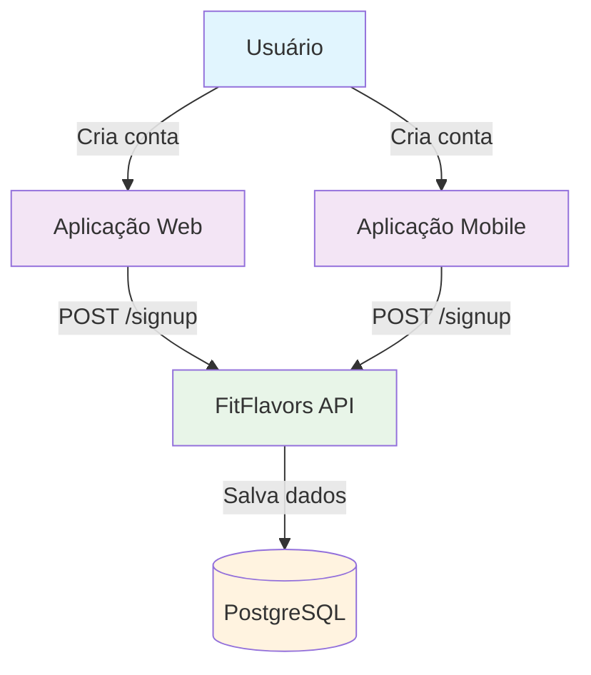
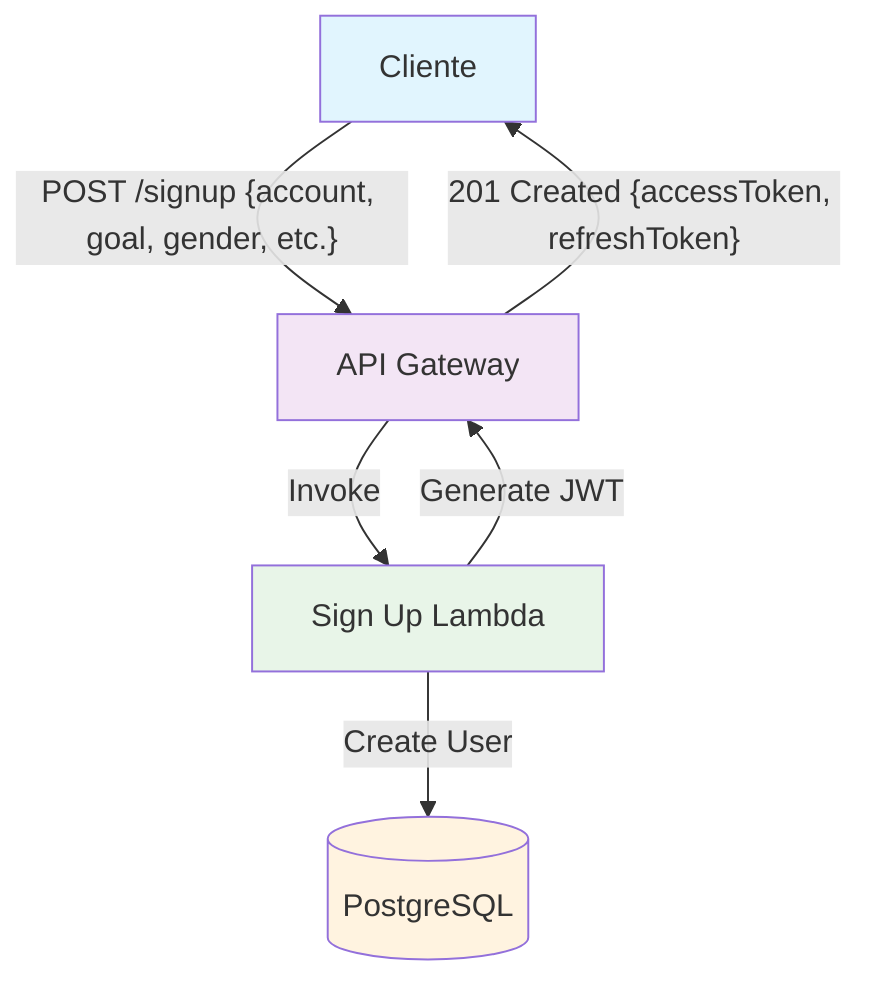
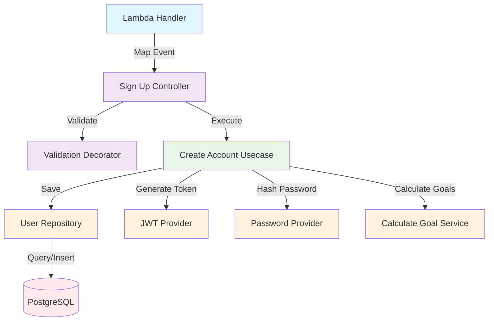
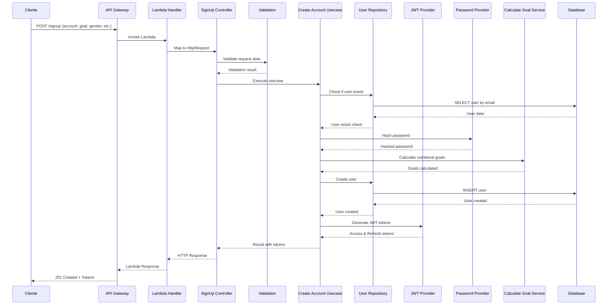

# C4 Model - Sign Up Endpoint

## 🎯 Context (Nível 1)



**Descrição:** O endpoint de Sign Up permite que novos usuários criem contas na aplicação FitFlavors, fornecendo informações pessoais e de fitness para cálculo de metas nutricionais.

## 🏗️ Container (Nível 2)



**Componentes:**

- **API Gateway**: Recebe requisições HTTP e roteia para Lambda
- **Sign Up Lambda**: Processa criação de conta e gera tokens JWT
- **PostgreSQL**: Armazena dados do usuário

## 🔧 Component (Nível 3)



**Fluxo de Execução:**

1. **Lambda Handler** mapeia evento API Gateway para HttpRequest
2. **Sign Up Controller** recebe requisição e aplica validação
3. **Create Account Usecase** executa lógica de negócio
4. **Providers** executam operações específicas (JWT, senha, metas)
5. **User Repository** persiste dados no banco

## 💻 Code (Nível 4)

### **Estrutura de Arquivos**

```
src/
├── infra/functions/signup.ts           # Lambda Handler
├── domain/users/controllers/
│   └── sign-up.controller.ts           # Controller
├── domain/users/usecases/
│   └── create-account.usecase.ts       # Use Case
├── domain/users/repositories/
│   └── user.repository.ts              # Repository Interface
├── infra/db/drizzle/repositories/
│   └── drizzle-user.repository.ts      # Repository Implementation
├── infra/providers/
│   ├── jwt.provider.ts                 # JWT Provider
│   └── password.provider.ts            # Password Provider
└── domain/users/services/
    └── calculate-goal.ts               # Goal Calculation Service
```

### **Fluxo de Dados**



### **Validações**

```typescript
const schema = z.object({
  goal: z.enum(['lose', 'maintain', 'gain']),
  gender: z.enum(['male', 'female']),
  birthDate: z.iso.date(),
  height: z.number().positive(),
  weight: z.number().positive(),
  activityLevel: z.number().min(1).max(5),
  account: z.object({
    name: z.string().min(1),
    email: z.email(),
    password: z.string().min(8),
  }),
});
```

### **Resposta de Sucesso**

```typescript
{
  "accessToken": "eyJhbGciOiJIUzI1NiIsInR5cCI6IkpXVCJ9...",
  "refreshToken": "eyJhbGciOiJIUzI1NiIsInR5cCI6IkpXVCJ9..."
}
```

### **Tratamento de Erros**

- **400 Bad Request**: Dados de validação inválidos
- **409 Conflict**: Email já cadastrado
- **500 Internal Server Error**: Erro interno do servidor

## 📊 Métricas e Monitoramento

### **Métricas de Sucesso**

- Taxa de criação de contas bem-sucedidas
- Tempo de resposta do endpoint
- Uso de memória da Lambda

### **Métricas de Erro**

- Taxa de validação falhada
- Taxa de emails duplicados
- Erros de banco de dados

### **Logs Importantes**

- Tentativas de criação de conta
- Erros de validação
- Falhas na geração de JWT
- Problemas de conectividade com banco

## 🔒 Considerações de Segurança

- **Validação rigorosa** de dados de entrada
- **Criptografia de senhas** com bcrypt
- **Geração segura** de tokens JWT
- **Verificação de duplicatas** de email
- **Rate limiting** no API Gateway
- **Logs de auditoria** para tentativas de criação

## 🚀 Melhorias Futuras

1. **Verificação de email** obrigatória
2. **Validação de força** da senha
3. **Captcha** para prevenir spam
4. **Logs de auditoria** mais detalhados
5. **Métricas de negócio** (conversão, abandono)
