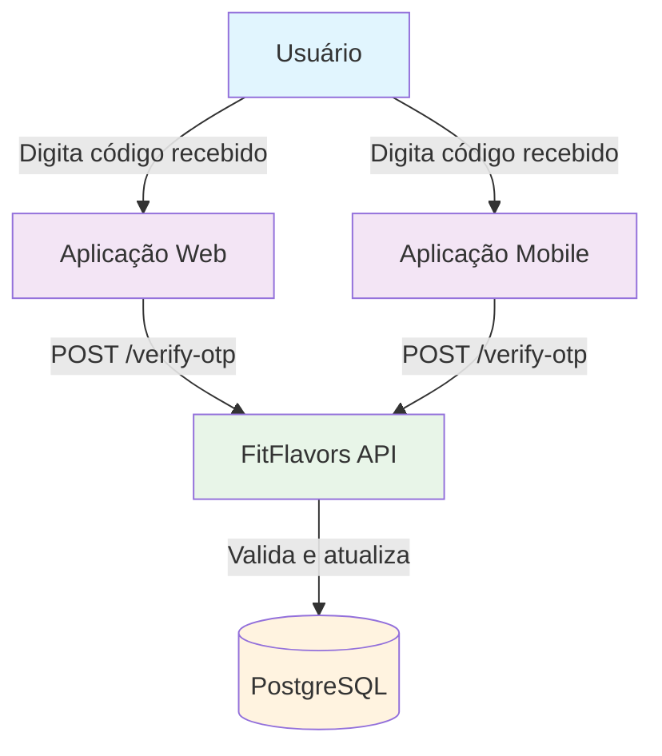
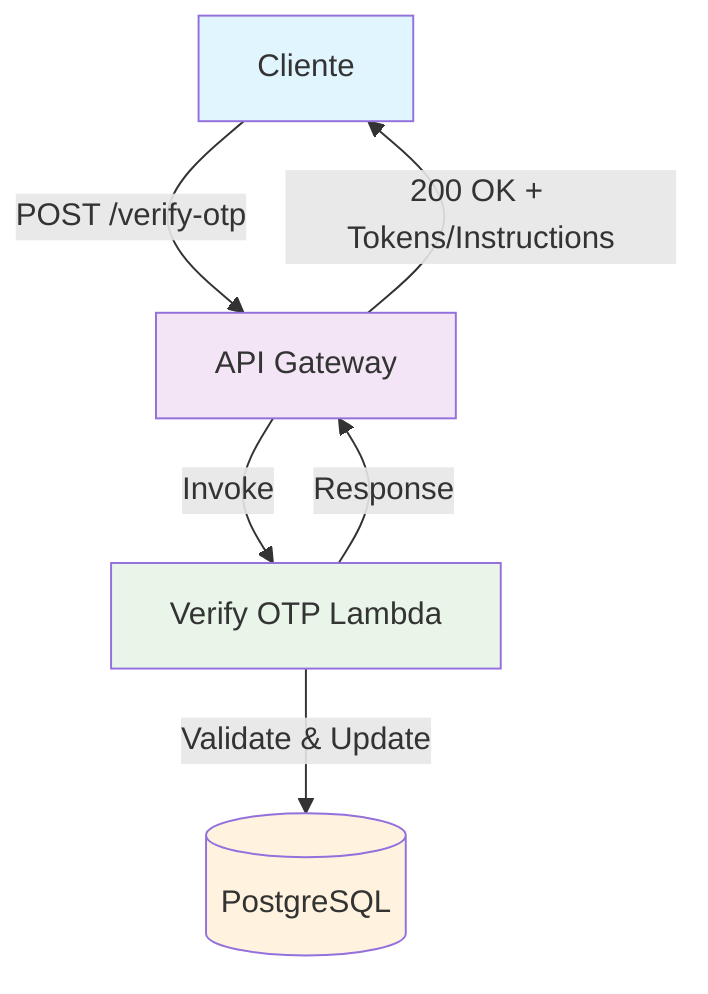
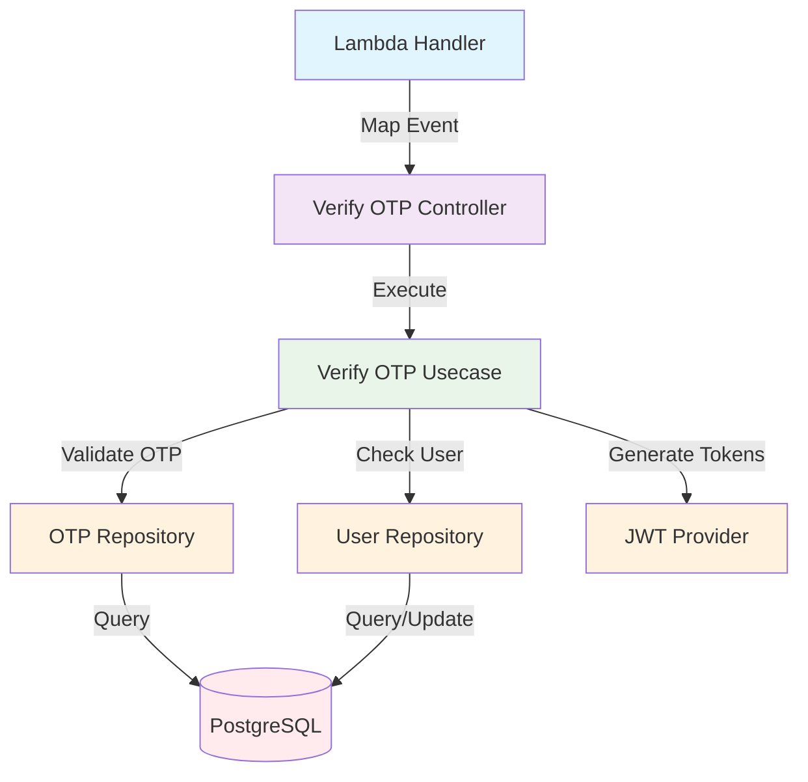
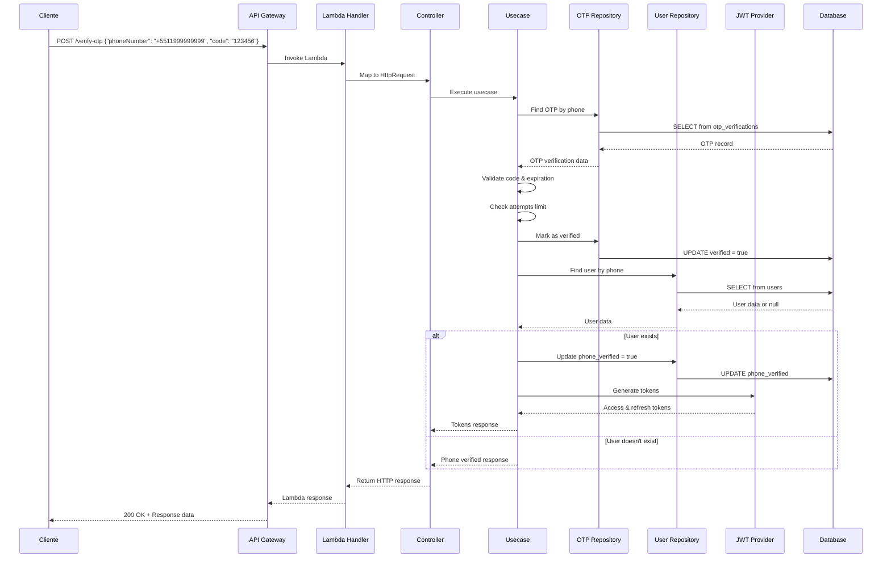

# C4 Model - Verify OTP Endpoint

## 🎯 Context (Nível 1)



**Descrição:** Endpoint responsável por validar códigos OTP recebidos via WhatsApp, verificar se o usuário já existe e retornar tokens JWT ou instruções para completar cadastro.

## 🏗️ Container (Nível 2)



**Componentes:**

- **API Gateway**: Recebe requisições HTTP e roteia para Lambda
- **Verify OTP Lambda**: Valida código OTP e gerencia fluxo de autenticação
- **PostgreSQL**: Armazena códigos OTP e dados de usuários

## 🔧 Component (Nível 3)



**Fluxo de Execução:**

1. **Lambda Handler** mapeia evento API Gateway para HttpRequest
2. **Controller** recebe requisição e aplica validações
3. **Usecase** executa lógica: valida OTP, verifica usuário, gera tokens
4. **OTP Repository** marca código como verificado
5. **User Repository** atualiza campo phone_verified se usuário existe
6. **JWT Provider** gera tokens se usuário autenticado

## 💻 Code (Nível 4)

### **Estrutura de Arquivos**

```
src/
├── infra/functions/
│   └── verify-otp.ts                     # Lambda Handler
├── domain/users/controllers/
│   └── verify-otp.controller.ts          # Controller
├── domain/users/usecases/
│   └── verify-otp.usecase.ts             # Use Case
├── domain/users/repositories/
│   ├── otp-verification.repository.ts    # OTP Repository Interface
│   └── user.repository.ts                # User Repository Interface
├── infra/db/drizzle/repositories/
│   ├── drizzle-otp-verification.repository.ts # OTP Repository Implementation
│   └── drizzle-user.repository.ts        # User Repository Implementation
├── domain/users/providers/
│   └── jwt.provider.ts                   # JWT Provider Interface
├── infra/providers/
│   └── jwt.provider.ts                   # JWT Provider Implementation
└── domain/users/dtos/
    └── verify-otp.dto.ts                 # Request/Response DTOs
```

### **Fluxo de Dados**



### **Validações**

```typescript
const schema = z.object({
  phoneNumber: z
    .string()
    .regex(/^\+[1-9]\d{1,14}$/, 'Formato de telefone inválido'),
  code: z
    .string()
    .regex(/^\d{6}$/, 'Código deve ter exatamente 6 dígitos')
    .length(6, 'Código deve ter 6 dígitos'),
});
```

### **Request Body**

```typescript
{
  "phoneNumber": "+5511999999999",
  "code": "123456"
}
```

### **Response de Sucesso - Usuário Existente**

```typescript
{
  "verified": true,
  "userExists": true,
  "accessToken": "eyJhbGciOiJIUzI1NiIsInR5cCI6IkpXVCJ9...",
  "refreshToken": "eyJhbGciOiJIUzI1NiIsInR5cCI6IkpXVCJ9...",
  "user": {
    "id": "user-123",
    "name": "João Silva",
    "email": "joao@email.com",
    "phoneNumber": "+5511999999999",
    "phoneVerified": true
  }
}
```

### **Response de Sucesso - Novo Usuário**

```typescript
{
  "verified": true,
  "userExists": false,
  "phoneNumber": "+5511999999999",
  "message": "Telefone verificado com sucesso. Complete seu cadastro para continuar."
}
```

### **Response de Erro**

```typescript
// Código inválido
{
  "error": "InvalidOTP",
  "message": "Código inválido ou expirado"
}

// Muitas tentativas
{
  "error": "TooManyAttempts",
  "message": "Máximo de tentativas excedido. Solicite um novo código.",
  "maxAttempts": 5
}

// Código já usado
{
  "error": "OTPAlreadyUsed",
  "message": "Este código já foi utilizado"
}

// Código expirado
{
  "error": "ExpiredOTP",
  "message": "Código expirou. Solicite um novo código."
}
```

### **Tratamento de Erros**

- **400 Bad Request**: Dados de validação inválidos
- **400 Bad Request**: Código inválido, expirado ou já usado
- **429 Too Many Requests**: Muitas tentativas de verificação
- **500 Internal Server Error**: Erro interno do servidor

## 📊 Métricas e Monitoramento

### **Métricas de Sucesso**

- Taxa de verificação bem-sucedida (>80%)
- Tempo de resposta do endpoint (<2s)
- Taxa de conversão para login automático
- Uso de memória da Lambda (<128MB)

### **Métricas de Erro**

- Taxa de códigos inválidos
- Taxa de códigos expirados
- Tentativas acima do limite
- Erros de banco de dados

### **Métricas de Segurança**

- Tentativas de força bruta
- Padrões de códigos inválidos por IP
- Taxa de verificações por número

### **Logs Importantes**

- Tentativas de verificação (sucesso/falha)
- Códigos expirados
- Limite de tentativas atingido
- Logins automáticos realizados

## 🔒 Considerações de Segurança

- **Validação rigorosa** de dados de entrada
- **Limite de tentativas** (5 por código)
- **Comparação segura** de códigos (timing-safe)
- **Rate limiting** para prevenir força bruta
- **Logs de auditoria** para tentativas de verificação
- **Limpeza automática** de códigos expirados
- **Não exposição** de códigos válidos em logs

## 🚀 Melhorias Futuras

1. **Cache de rate limiting** com Redis
2. **Notificação de login** via WhatsApp
3. **Detecção de padrões suspeitos** com ML
4. **Backup de verificação** por SMS
5. **Dashboard de analytics** em tempo real

## 📝 Checklist de Implementação

### **Desenvolvimento**

- [ ] Criar Lambda Handler
- [ ] Implementar Controller com validações
- [ ] Implementar Use Case com lógica complexa
- [ ] Criar DTOs (Request/Response)
- [ ] Implementar validação de OTP
- [ ] Integrar com User Repository
- [ ] Adicionar geração de JWT
- [ ] Implementar limite de tentativas

### **Testes**

- [ ] Testes unitários para Use Case
- [ ] Testes de integração para Controller
- [ ] Testes de validação de código
- [ ] Testes de limite de tentativas
- [ ] Testes de códigos expirados
- [ ] Testes de geração de JWT
- [ ] Testes de fluxo completo

### **Deploy**

- [ ] Configurar no serverless.yml
- [ ] Configurar timeout da Lambda (15s)
- [ ] Testar em ambiente de desenvolvimento
- [ ] Configurar alertas CloudWatch
- [ ] Configurar métricas personalizadas

### **Monitoramento**

- [ ] Configurar métricas de CloudWatch
- [ ] Configurar alertas de erro e latência
- [ ] Implementar logs estruturados
- [ ] Dashboard para métricas de verificação
- [ ] Alertas para padrões suspeitos

---

**Nota:** Este endpoint é **público** (não requer autenticação) pois é usado para verificar identidade antes do login.
