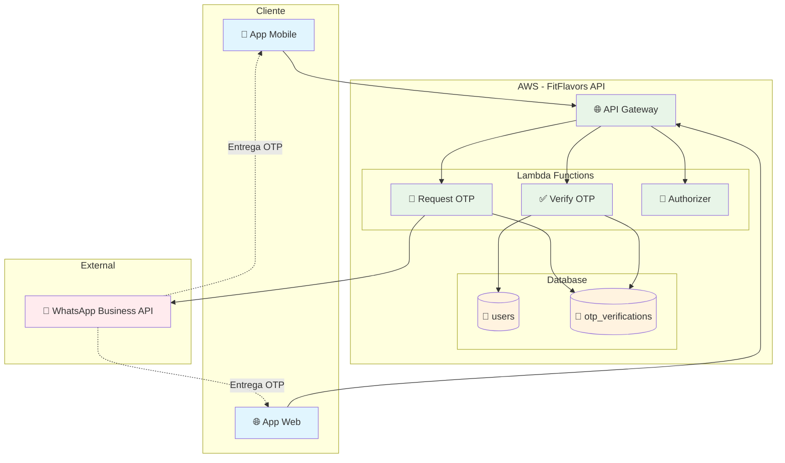
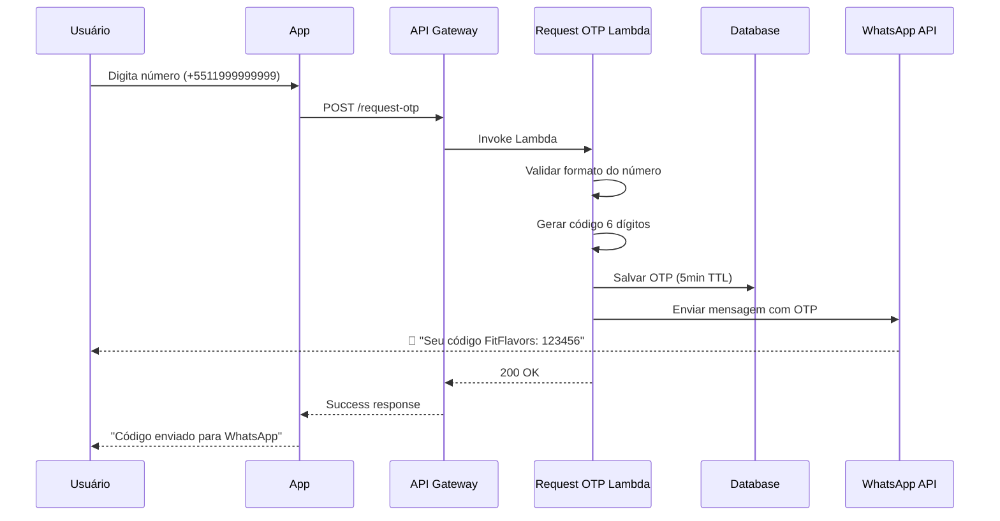
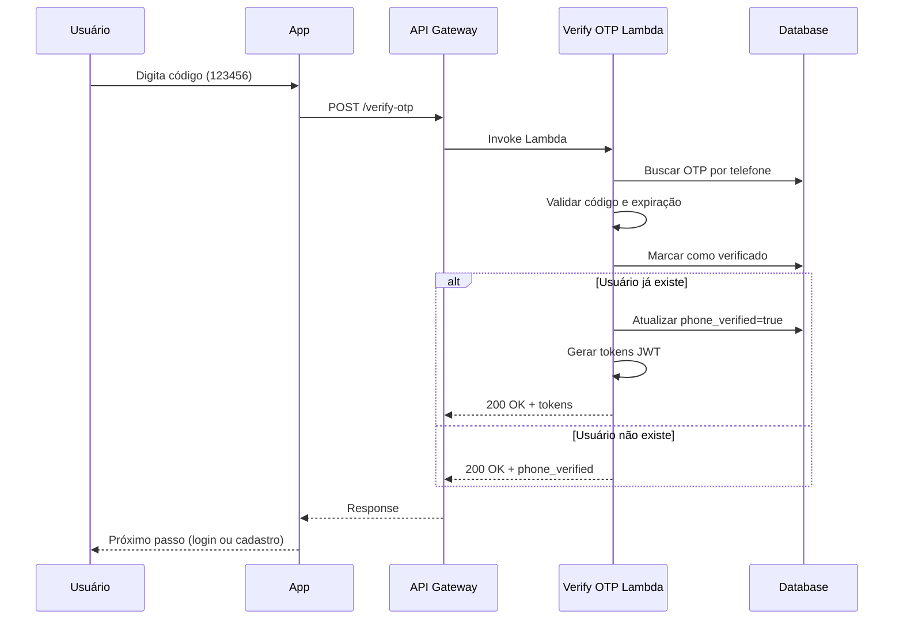
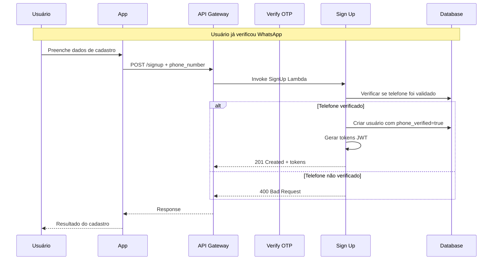

# 📱 Sistema de OTP via WhatsApp - FitFlavors API

**Versão:** 1.0  
**Data:** 17 de setembro de 2025  
**Status:** Em Desenvolvimento  
**Responsável:** Equipe FitFlavors

## 🎯 Visão Geral

O Sistema de OTP (One-Time Password) via WhatsApp permite validar números de telefone dos usuários durante o processo de cadastro e autenticação, utilizando a API oficial do WhatsApp Business para envio de códigos de verificação.

### **Objetivos**

- ✅ **Validar números de telefone** dos usuários
- ✅ **Aumentar a segurança** do processo de autenticação
- ✅ **Melhorar UX** com verificação via WhatsApp (canal preferido no Brasil)
- ✅ **Prevenir contas fake** e melhorar qualidade da base de usuários
- ✅ **Habilitar comunicação direta** para notificações futuras

### **Benefícios de Negócio**

- **↑ Taxa de Conversão**: Verificação mais simples que SMS
- **↑ Confiabilidade**: WhatsApp tem alta taxa de entrega
- **↓ Fraudes**: Dificuldade de criar contas falsas
- **↑ Engajamento**: Canal direto para comunicação futura

## 🏗️ Arquitetura

### **Visão Geral**



### **Integração com Arquitetura Atual**

O sistema de OTP integra-se perfeitamente com a arquitetura serverless existente:

- **Clean Architecture**: Mantém separação de responsabilidades
- **DDD**: **Subdomínio de `users`** seguindo padrões estabelecidos
- **Serverless**: Reutiliza Lambda, API Gateway e infraestrutura AWS
- **Drizzle ORM**: Utiliza o mesmo ORM para persistência
- **JWT**: Integra com sistema de autenticação atual

## 📊 Estrutura de Dados

### **Nova Tabela: `otp_verifications`**

```sql
CREATE TABLE otp_verifications (
  id UUID PRIMARY KEY DEFAULT gen_random_uuid(),
  phone_number VARCHAR(20) NOT NULL,
  code VARCHAR(6) NOT NULL,
  expires_at TIMESTAMP NOT NULL,
  verified BOOLEAN NOT NULL DEFAULT false,
  attempts INTEGER NOT NULL DEFAULT 0,
  created_at TIMESTAMP NOT NULL DEFAULT NOW(),
  updated_at TIMESTAMP NOT NULL
);

-- Índices para performance
CREATE INDEX idx_otp_phone_number ON otp_verifications(phone_number);
CREATE INDEX idx_otp_expires_at ON otp_verifications(expires_at);
CREATE INDEX idx_otp_verified ON otp_verifications(verified);
```

### **Modificações na Tabela `users`**

```sql
-- Adicionar campos para WhatsApp
ALTER TABLE users ADD COLUMN phone_number VARCHAR(20) UNIQUE;
ALTER TABLE users ADD COLUMN phone_verified BOOLEAN NOT NULL DEFAULT false;

-- Índice para busca por telefone
CREATE INDEX idx_users_phone_number ON users(phone_number);
```

### **Modelo de Dados**

```typescript
// Entidade OTP Verification
export type OTPVerificationProps = {
  phoneNumber: string;
  code: string;
  expiresAt: Date;
  verified: boolean;
  attempts: number;
  createdAt: Date;
  updatedAt: Date;
};

// User com novos campos
export type UserProps = {
  // ... campos existentes
  phoneNumber?: string;
  phoneVerified: boolean;
};
```

## 🔄 Fluxos de Processo

### **Fluxo 1: Solicitação de OTP**



### **Fluxo 2: Verificação de OTP**



### **Fluxo 3: Integração com Cadastro**



## 🔌 API Endpoints

### **POST /request-otp**

**Descrição:** Solicita envio de código OTP via WhatsApp

**Request:**

```typescript
{
  "phoneNumber": "+5511999999999"
}
```

**Response Success (200):**

```typescript
{
  "message": "Código enviado para WhatsApp",
  "expiresIn": 300 // segundos
}
```

**Response Error (400):**

```typescript
{
  "error": "ValidationError",
  "message": "Número de telefone inválido"
}
```

**Response Error (429):**

```typescript
{
  "error": "RateLimitExceeded",
  "message": "Muitas tentativas. Tente novamente em 60 segundos"
}
```

---

### **POST /verify-otp**

**Descrição:** Verifica código OTP recebido

**Request:**

```typescript
{
  "phoneNumber": "+5511999999999",
  "code": "123456"
}
```

**Response Success - Usuário Existente (200):**

```typescript
{
  "verified": true,
  "userExists": true,
  "accessToken": "eyJhbGciOiJIUzI1NiIs...",
  "refreshToken": "eyJhbGciOiJIUzI1NiIs..."
}
```

**Response Success - Novo Usuário (200):**

```typescript
{
  "verified": true,
  "userExists": false,
  "message": "Telefone verificado. Complete seu cadastro."
}
```

**Response Error (400):**

```typescript
{
  "error": "InvalidOTP",
  "message": "Código inválido ou expirado"
}
```

**Response Error (429):**

```typescript
{
  "error": "TooManyAttempts",
  "message": "Máximo de tentativas excedido"
}
```

## 🔒 Segurança e Validações

### **Rate Limiting**

- **Request OTP**: 1 por minuto por número
- **Verify OTP**: 5 tentativas por código
- **IP Blocking**: Bloqueio temporário após 10 falhas

### **Validações**

#### **Número de Telefone**

```typescript
const phoneRegex = /^\+[1-9]\d{1,14}$/;
// Formato internacional obrigatório
// Ex: +5511999999999
```

#### **Código OTP**

```typescript
const otpRegex = /^\d{6}$/;
// Exatamente 6 dígitos numéricos
// Ex: 123456
```

#### **Expiração**

- **TTL**: 5 minutos
- **Cleanup**: Job automático remove códigos expirados

### **Proteções**

- **Força Bruta**: Limite de tentativas por código
- **Replay Attack**: Código usado apenas uma vez
- **Timing Attack**: Comparação constante de códigos
- **Phone Enumeration**: Rate limiting previne varredura

## 📱 Integração WhatsApp Business API

### **Configuração Necessária**

1. **Meta Business Account**
2. **WhatsApp Business App** configurado
3. **Webhook URL** (opcional, para status de entrega)
4. **Template de Mensagem** aprovado

### **Template de Mensagem**

**Nome:** `fitflavors_otp_verification`

**Categoria:** `AUTHENTICATION`

**Idioma:** `pt_BR`

**Conteúdo:**

```
🥗 *FitFlavors*

Seu código de verificação é: *{{1}}*

Válido por 5 minutos.

_Não compartilhe este código._
```

### **Envio de Mensagem**

```typescript
// Gateway WhatsApp
const whatsappPayload = {
  messaging_product: 'whatsapp',
  to: phoneNumber,
  type: 'template',
  template: {
    name: 'fitflavors_otp_verification',
    language: { code: 'pt_BR' },
    components: [
      {
        type: 'body',
        parameters: [{ type: 'text', text: otpCode }],
      },
    ],
  },
};
```

### **Webhook para Status** (Opcional)

```typescript
// Webhook para receber status de entrega
interface WhatsAppWebhook {
  entry: [
    {
      changes: [
        {
          value: {
            statuses: [
              {
                id: string;
                status: 'sent' | 'delivered' | 'read' | 'failed';
                timestamp: string;
                recipient_id: string;
              },
            ];
          };
        },
      ];
    },
  ];
}
```

## 🧪 Estratégia de Testes

### **Testes Unitários**

```typescript
// Use Cases
describe('RequestOTPUsecase', () => {
  it('should generate 6-digit code');
  it('should set 5-minute expiration');
  it('should prevent duplicate active codes');
  it('should respect rate limiting');
});

describe('VerifyOTPUsecase', () => {
  it('should verify valid code');
  it('should reject expired code');
  it('should reject invalid code');
  it('should limit attempts');
});
```

### **Testes de Integração**

```typescript
// Controllers
describe('POST /request-otp', () => {
  it('should send OTP for valid phone');
  it('should return 400 for invalid phone');
  it('should return 429 for rate limit');
});

describe('POST /verify-otp', () => {
  it('should verify OTP and return tokens for existing user');
  it('should verify OTP for new user');
  it('should return 400 for invalid OTP');
});
```

### **Testes E2E**

```typescript
describe('OTP Flow', () => {
  it('should complete full verification flow');
  it('should integrate with signup flow');
  it('should integrate with signin flow');
});
```

### **Testes de Mock WhatsApp**

```typescript
// Mock para desenvolvimento
class MockWhatsAppGateway {
  async sendOTP(phoneNumber: string, code: string) {
    // Log OTP para desenvolvimento
    console.log(`📱 WhatsApp Mock: ${phoneNumber} -> ${code}`);
    return { success: true, messageId: 'mock-123' };
  }
}
```

## 📊 Monitoramento e Métricas

### **Métricas de Negócio**

- **Taxa de Entrega**: % de OTPs entregues
- **Taxa de Verificação**: % de códigos verificados corretamente
- **Taxa de Conversão**: % de verificações que viram cadastros
- **Tempo Médio**: Entre envio e verificação

### **Métricas Técnicas**

- **Latência**: Tempo de resposta dos endpoints
- **Throughput**: Requisições por segundo
- **Error Rate**: Taxa de erros por tipo
- **Lambda Duration**: Tempo de execução das funções

### **Alertas CloudWatch**

```yaml
# Alertas críticos
- OTP delivery rate < 95%
- Verification rate < 80%
- Error rate > 5%
- Lambda duration > 10s
- WhatsApp API errors > 10/min
```

### **Dashboard Grafana**

```json
{
  "panels": [
    { "title": "OTP Requests/min", "type": "graph" },
    { "title": "Verification Success Rate", "type": "stat" },
    { "title": "WhatsApp API Status", "type": "stat" },
    { "title": "Error Distribution", "type": "pie" }
  ]
}
```

## 💰 Custos e Limites

### **WhatsApp Business API**

- **Template Messages**: ~$0.005 - $0.009 por mensagem
- **Rate Limits**:
  - 1.000 mensagens/dia (novos negócios)
  - Limite cresce com uso aprovado

### **AWS Lambda**

- **Requests**: 1M gratuitas/mês
- **Duration**: 400.000 GB-seg gratuitos/mês
- **Custo estimado**: ~$0.000001 por verificação OTP

### **Database (Neon)**

- **Armazenamento**: Crescimento mínimo (~1KB por verificação)
- **Queries**: 2-3 queries por verificação
- **Custo**: Negligível dentro do plano atual

### **Estimativa Total**

Para **1.000 verificações/mês**:

- WhatsApp: ~$5-9 USD
- AWS: ~$0.10 USD
- **Total**: ~$5-10 USD/mês

## 🚀 Roadmap e Melhorias

### **Fase 1: MVP** ✅ _Q4 2025_

- [x] Implementação básica de OTP
- [x] Integração com WhatsApp Business API
- [x] Endpoints de request/verify
- [x] Validações básicas de segurança

### **Fase 2: Melhorias** 📝 _Q1 2026_

- [ ] **Webhook de status** para confirmar entrega
- [ ] **Retry automático** para falhas temporárias
- [ ] **Analytics avançados** no dashboard
- [ ] **Templates personalizados** por evento

### **Fase 3: Escala** 🔄 _Q2 2026_

- [ ] **Cache Redis** para performance
- [ ] **Multi-região** para disponibilidade
- [ ] **A/B testing** de templates
- [ ] **ML para detecção de fraude**

### **Fase 4: Avançado** 🚀 _Q3 2026_

- [ ] **OTP por voz** como fallback
- [ ] **Biometria** como alternativa
- [ ] **Verificação em lote** para admins
- [ ] **API pública** para parceiros

## 🔧 Configuração de Desenvolvimento

### **Variáveis de Ambiente**

```bash
# .env
WHATSAPP_API_URL=https://graph.facebook.com/v18.0
WHATSAPP_ACCESS_TOKEN=your_access_token
WHATSAPP_PHONE_NUMBER_ID=your_phone_number_id
WHATSAPP_WEBHOOK_VERIFY_TOKEN=your_webhook_token

# Para desenvolvimento local
NODE_ENV=development
OTP_MOCK_MODE=true  # Mock WhatsApp API
```

### **Setup Local**

```bash
# Instalar dependências
npm install axios

# Executar migrações
npm run db:migrate

# Modo desenvolvimento (com mock)
npm run dev

# Testes
npm run test
npm run test:e2e
```

### **Mock para Desenvolvimento**

```typescript
// src/infra/gateways/mock-whatsapp.gateway.ts
export class MockWhatsAppGateway implements WhatsAppGateway {
  async sendOTP(phoneNumber: string, code: string) {
    console.log(`📱 [MOCK] WhatsApp para ${phoneNumber}: ${code}`);

    // Simular delays da API real
    await new Promise(resolve => setTimeout(resolve, 1000));

    return {
      success: true,
      messageId: `mock-${Date.now()}`,
      status: 'sent',
    };
  }
}
```

## 📚 Documentação Adicional

### **Links Relacionados**

- **[ADR-003: WhatsApp OTP Integration](../adrs/adr-003-whatsapp-otp-integration.md)**
- **[Request OTP Endpoint C4](../endpoints/request-otp-c4.md)**
- **[Verify OTP Endpoint C4](../endpoints/verify-otp-c4.md)**
- **[WhatsApp Business API Docs](https://developers.facebook.com/docs/whatsapp)**

### **Recursos Externos**

- **[Clean Architecture](https://blog.cleancoder.com/uncle-bob/2012/08/13/the-clean-architecture.html)**
- **[DDD Best Practices](https://martinfowler.com/bliki/DomainDrivenDesign.html)**
- **[AWS Lambda Best Practices](https://docs.aws.amazon.com/lambda/latest/dg/best-practices.html)**
- **[WhatsApp Business API Getting Started](https://developers.facebook.com/docs/whatsapp/getting-started)**

---

**📅 Última Atualização:** 17 de setembro de 2025  
**👥 Mantido por:** Equipe FitFlavors Development  
**📧 Contato:** dev@fitflavors.com  
**🔄 Próxima Revisão:** Q4 2025
