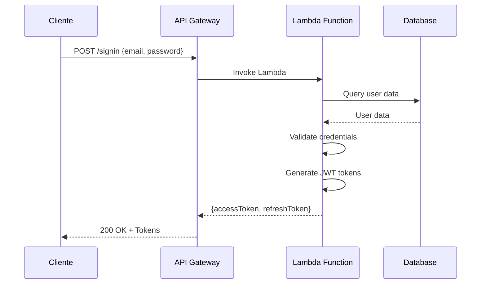
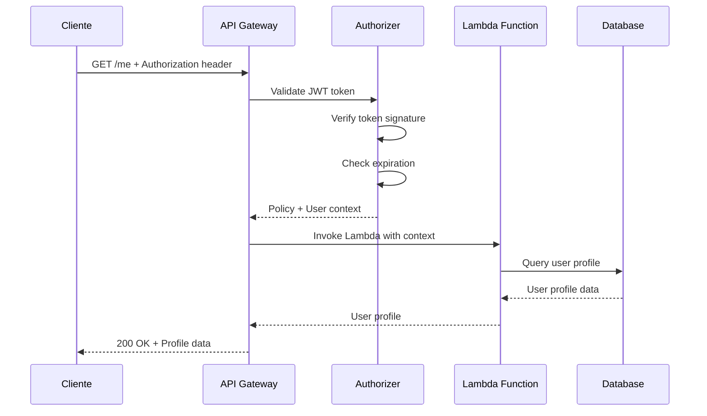
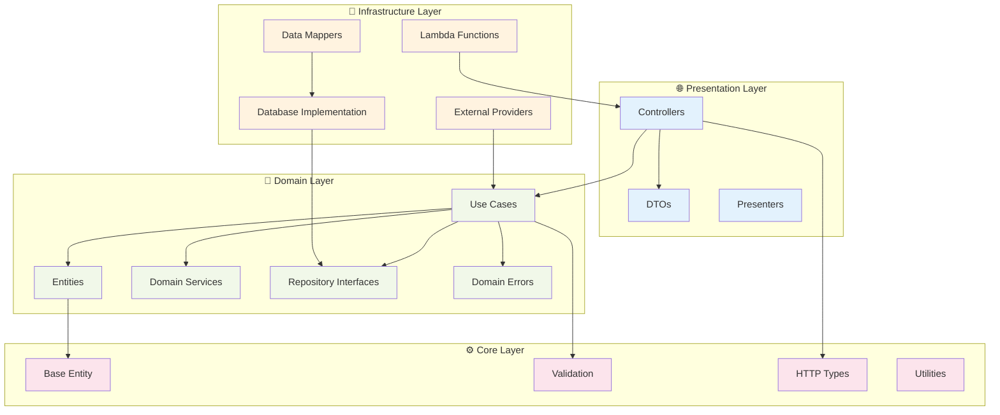
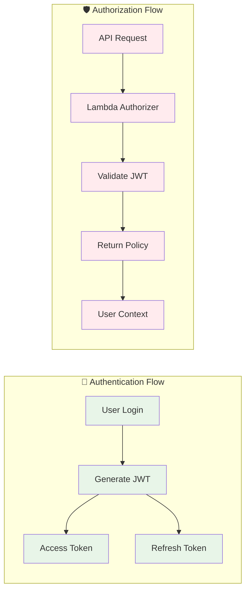
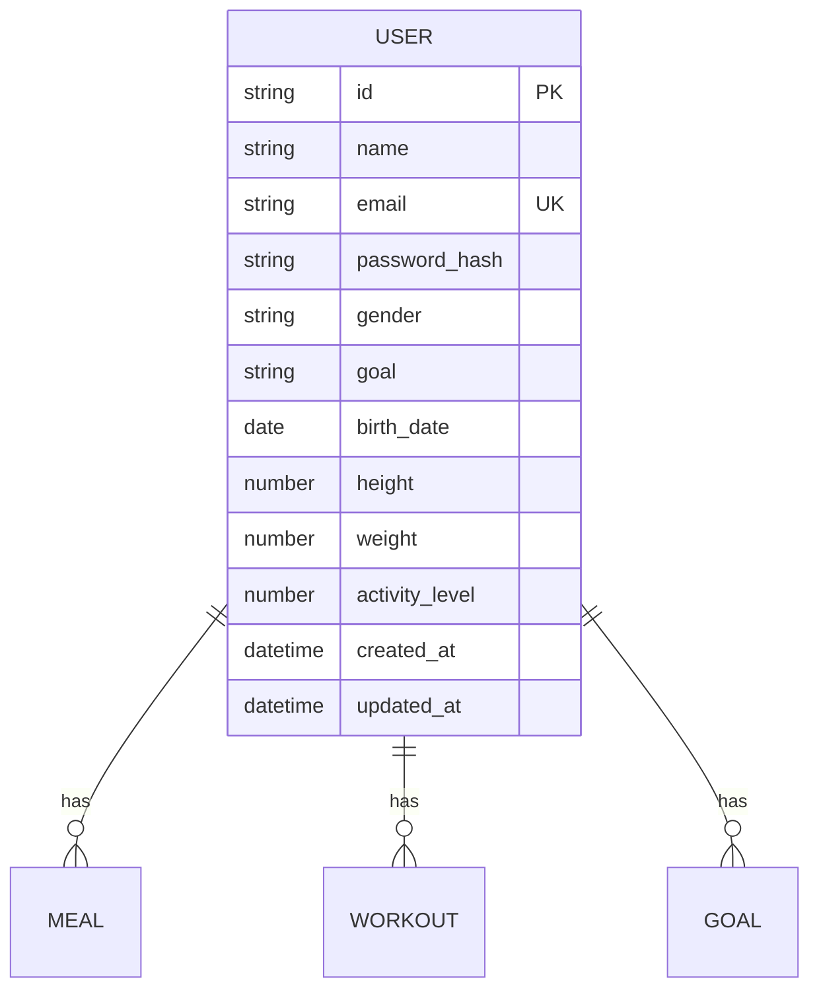
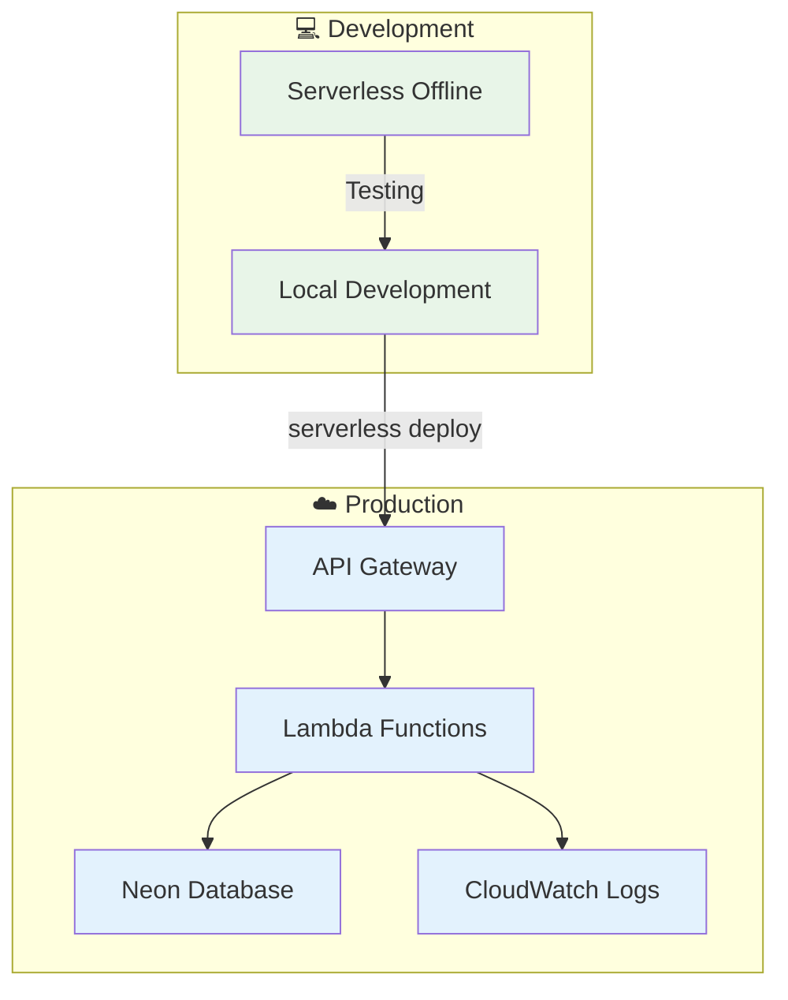
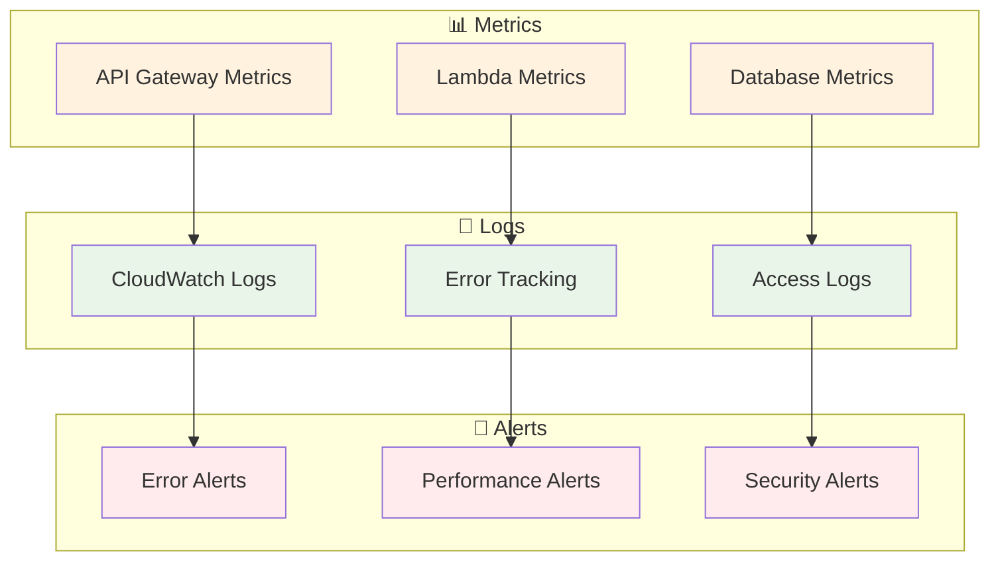

# Arquitetura do Projeto - FitFlavors API

## 🏗️ Visão Geral

O FitFlavors API é uma aplicação serverless construída com **AWS Lambda** e **API Gateway**, seguindo os princípios de **Clean Architecture** e **Domain-Driven Design (DDD)**. A aplicação é desenvolvida em **TypeScript** e utiliza **Drizzle ORM** para persistência de dados.

### 🎯 **Propósito**

API para aplicação de controle nutricional e fitness, permitindo que usuários:

- Criem e gerenciem suas contas
- Façam login de forma segura
- Acessem seus perfis e dados pessoais
- Calculem metas nutricionais baseadas em objetivos

### 🏛️ **Arquitetura Geral**

- **Padrão**: Clean Architecture + DDD
- **Deployment**: Serverless (AWS Lambda + API Gateway)
- **Banco de Dados**: PostgreSQL (Neon)
- **Autenticação**: JWT com Lambda Authorizer
- **ORM**: Drizzle ORM
- **Runtime**: Node.js 22.x (ARM64)

### 📊 **Endpoints Disponíveis**

- `POST /signup` - Criação de conta de usuário
- `POST /signin` - Autenticação de usuário
- `GET /me` - Perfil do usuário (protegido)

### 🔐 **Segurança**

- Validação de JWT no API Gateway
- Criptografia de senhas com bcrypt
- Isolamento de funções Lambda
- Políticas de autorização granulares

## 🎯 Tecnologias Principais

- **Runtime**: Node.js 22.x (ARM64)
- **Framework**: Serverless Framework
- **Cloud Provider**: AWS
- **Database**: Neon (PostgreSQL)
- **ORM**: Drizzle ORM
- **Authentication**: JWT + Lambda Authorizer
- **Language**: TypeScript

## 📊 Diagrama de Arquitetura

```mermaid
graph TB
    %% Cliente
    Client[👤 Cliente Web/Mobile]

    %% API Gateway
    APIGateway[🌐 API Gateway]

    %% Lambda Authorizer
    Authorizer[🔐 Lambda Authorizer<br/>JWT Validation]

    %% Lambda Functions
    SignIn[📝 Sign In Lambda]
    SignUp[📝 Sign Up Lambda]
    Profile[👤 Profile Lambda]

    %% Database
    Database[(🗄️ Neon PostgreSQL<br/>Drizzle ORM)]

    %% Fluxo de autenticação
    Client -->|1. Request + JWT| APIGateway
    APIGateway -->|2. Validate Token| Authorizer
    Authorizer -->|3. Policy + Context| APIGateway

    %% Rotas públicas
    APIGateway -->|4a. POST /signin| SignIn
    APIGateway -->|4b. POST /signup| SignUp

    %% Rotas protegidas
    APIGateway -->|4c. GET /me<br/>(Authorized)| Profile

    %% Acesso ao banco
    SignIn -->|Query| Database
    SignUp -->|Insert| Database
    Profile -->|Query| Database

    %% Respostas
    SignIn -->|5a. JWT Tokens| APIGateway
    SignUp -->|5b. JWT Tokens| APIGateway
    Profile -->|5c. User Data| APIGateway
    APIGateway -->|6. Response| Client

    %% Estilos
    classDef client fill:#e1f5fe
    classDef gateway fill:#f3e5f5
    classDef lambda fill:#e8f5e8
    classDef database fill:#fff3e0
    classDef authorizer fill:#ffebee

    class Client client
    class APIGateway gateway
    class SignIn,SignUp,Profile lambda
    class Database database
    class Authorizer authorizer
```

## 🔄 Fluxo de Requisições

### **1. Rotas Públicas (Sign In/Sign Up)**



### **2. Rotas Protegidas (Profile)**



## 🏛️ Arquitetura de Camadas



## 🔐 Sistema de Autenticação



## 📊 Estrutura de Dados

### **Entidade User**



## 🚀 Deploy e Infraestrutura



## 📈 Monitoramento e Observabilidade



## 🎯 Benefícios da Arquitetura

### **Escalabilidade**

- ✅ Auto-scaling com AWS Lambda
- ✅ Gerenciamento automático de recursos
- ✅ Pay-per-use pricing model

### **Segurança**

- ✅ JWT com validação no API Gateway
- ✅ Isolamento de funções Lambda
- ✅ Criptografia de senhas com bcrypt

### **Manutenibilidade**

- ✅ Clean Architecture
- ✅ Separação clara de responsabilidades
- ✅ Código testável e modular

### **Performance**

- ✅ Validação de token no gateway
- ✅ Cache de políticas de autorização
- ✅ Otimização com ARM64

## 🔧 Configuração de Ambiente

### **Variáveis de Ambiente**

```bash
DATABASE_URL=postgresql://...
JWT_SECRET=your-secret-key
JWT_EXPIRES_IN=7d
ENCRYPT_SALTS=10
```

### **Scripts Disponíveis**

```bash
npm run dev          # Desenvolvimento local
npm run lint         # Linting
npm run format       # Formatação
npm run type-check   # Verificação de tipos
npm run check        # Verificação completa
```

## 📚 Próximos Passos

1. **Implementar testes automatizados**
2. **Adicionar CI/CD pipeline**
3. **Implementar rate limiting**
4. **Adicionar cache Redis**
5. **Implementar observabilidade avançada**

---

**Nota:** Esta arquitetura foi projetada para ser escalável, segura e fácil de manter, seguindo as melhores práticas de desenvolvimento serverless.
