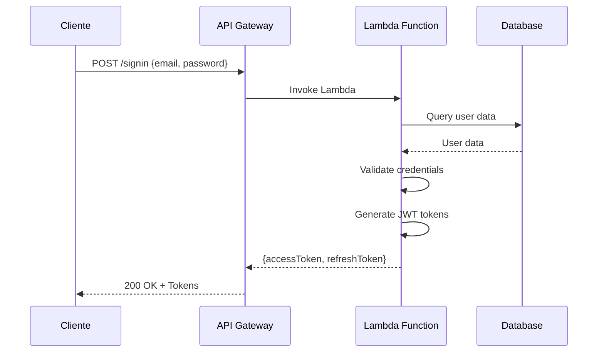
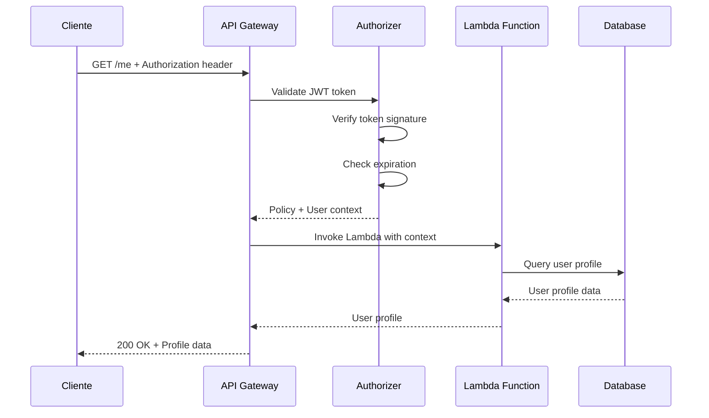

# Arquitetura do Projeto - FitFlavors API

## 🏗️ Visão Geral

API serverless para controle nutricional e fitness, construída com **AWS Lambda** e **API Gateway**, seguindo **Clean Architecture** e **DDD**.

### 🎯 **Funcionalidades Principais**

- 🔐 **Autenticação JWT** com validação no API Gateway
- 👤 **Gestão de usuários** com perfis completos
- 🎯 **Cálculo de metas nutricionais** baseado em objetivos
- 🔒 **Segurança robusta** com criptografia de senhas

### 🏛️ **Stack Tecnológica**

- **Runtime**: Node.js 22.x (ARM64)
- **Framework**: Serverless Framework
- **Cloud**: AWS (Lambda + API Gateway)
- **Database**: Neon (PostgreSQL)
- **ORM**: Drizzle ORM
- **Auth**: JWT + Lambda Authorizer
- **Language**: TypeScript

### 📊 **Endpoints da API**

| Método | Endpoint  | Descrição             | Auth |
| ------ | --------- | --------------------- | ---- |
| `POST` | `/signup` | Criação de conta      | ❌   |
| `POST` | `/signin` | Autenticação          | ❌   |
| `GET`  | `/me`     | Perfil do usuário     | ✅   |
| `POST` | `/meals`  | Criação de refeição   | ✅   |
| `GET`  | `/meals`  | Listagem de refeições | ✅   |

## 📊 **Estrutura de Dados**

Para informações detalhadas sobre entidades e relacionamentos, consulte:
**[ERD - Entity Relationship Diagram](./project/erd.md)**

## 📊 Diagrama de Arquitetura

```mermaid
graph TB
    %% Cliente
    Client[👤 Cliente Web/Mobile]

    %% API Gateway
    APIGateway[🌐 API Gateway]

    %% Lambda Authorizer
    Authorizer[🔐 Lambda Authorizer<br/>JWT Validation]

    %% Lambda Functions
    SignIn[📝 Sign In Lambda]
    SignUp[📝 Sign Up Lambda]
    Profile[👤 Profile Lambda]

    %% Database
    Database[(🗄️ Neon PostgreSQL<br/>Drizzle ORM)]

    %% Fluxo de autenticação
    Client -->|1. Request + JWT| APIGateway
    APIGateway -->|2. Validate Token| Authorizer
    Authorizer -->|3. Policy + Context| APIGateway

    %% Rotas públicas
    APIGateway -->|4a. POST /signin| SignIn
    APIGateway -->|4b. POST /signup| SignUp

    %% Rotas protegidas
    APIGateway -->|4c. GET /me<br/>(Authorized)| Profile

    %% Acesso ao banco
    SignIn -->|Query| Database
    SignUp -->|Insert| Database
    Profile -->|Query| Database

    %% Respostas
    SignIn -->|5a. JWT Tokens| APIGateway
    SignUp -->|5b. JWT Tokens| APIGateway
    Profile -->|5c. User Data| APIGateway
    APIGateway -->|6. Response| Client

    %% Estilos
    classDef client fill:#e1f5fe
    classDef gateway fill:#f3e5f5
    classDef lambda fill:#e8f5e8
    classDef database fill:#fff3e0
    classDef authorizer fill:#ffebee

    class Client client
    class APIGateway gateway
    class SignIn,SignUp,Profile lambda
    class Database database
    class Authorizer authorizer
```

## 🔄 Fluxo de Requisições

### **1. Rotas Públicas (Sign In/Sign Up)**



### **2. Rotas Protegidas (Profile)**



## 🏛️ **Arquitetura de Camadas**

Para detalhes sobre a organização de pastas e estrutura do código, consulte:
**[Arquitetura de Pastas](./folder-architecture.md)**

## 🔐 **Sistema de Autenticação**

Para detalhes sobre a estratégia de autenticação, consulte:
**[ADR-002: Validação de Autenticação](./adrs/adr-002-authentication-validation.md)**

## 🚀 **Deploy e Infraestrutura**

- **Desenvolvimento**: Serverless Offline para testes locais
- **Produção**: AWS Lambda + API Gateway + Neon Database
- **Monitoramento**: CloudWatch Logs e métricas
- **Deploy**: `npm run deploy` via Serverless Framework

## 🔧 **Configuração**

### **Variáveis de Ambiente**

```bash
DATABASE_URL=postgresql://...
JWT_SECRET=your-secret-key
JWT_EXPIRES_IN=7d
ENCRYPT_SALTS=10
```

### **Scripts Disponíveis**

```bash
npm run dev          # Desenvolvimento local
npm run lint         # Linting
npm run format       # Formatação
npm run type-check   # Verificação de tipos
npm run deploy       # Deploy para produção
```

## 📚 **Documentação Relacionada**

- **[ERD - Diagrama de Entidades](./project/erd.md)** - Estrutura do banco de dados
- **[Arquitetura de Pastas](./folder-architecture.md)** - Organização do código
- **[Decisões Arquiteturais](./adrs/)** - ADRs documentando escolhas técnicas
- **[Endpoints da API](./endpoints/)** - Documentação dos endpoints

---

**📅 Atualizado**: 2024-12-19 | **👥 Equipe**: FitFlavors Development
