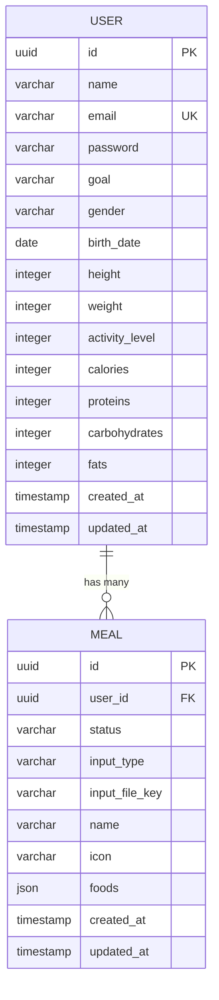
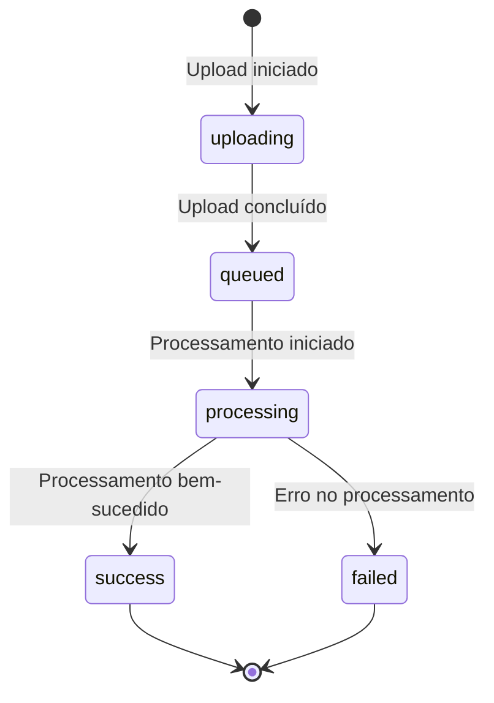
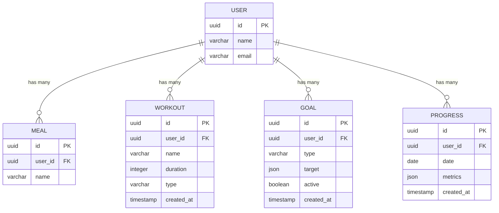

# ERD - Entity Relationship Diagram - FitFlavors API

## 📊 Visão Geral

Este documento apresenta o diagrama de entidades e relacionamentos (ERD) do sistema FitFlavors API, mostrando a estrutura do banco de dados e as relações entre as entidades.

## 🏗️ Diagrama Principal



## 📋 Entidades Detalhadas

### **USER (Usuário)**

| Campo            | Tipo         | Descrição                   | Restrições         |
| ---------------- | ------------ | --------------------------- | ------------------ |
| `id`             | UUID         | Identificador único         | PK, Auto-generated |
| `name`           | VARCHAR(255) | Nome completo               | NOT NULL           |
| `email`          | VARCHAR(255) | Email do usuário            | NOT NULL, UNIQUE   |
| `password`       | VARCHAR(255) | Hash da senha               | NOT NULL           |
| `goal`           | VARCHAR(8)   | Objetivo do usuário         | NOT NULL, ENUM     |
| `gender`         | VARCHAR(6)   | Gênero                      | NOT NULL, ENUM     |
| `birth_date`     | DATE         | Data de nascimento          | NOT NULL           |
| `height`         | INTEGER      | Altura em cm                | NOT NULL, > 0      |
| `weight`         | INTEGER      | Peso em gramas              | NOT NULL, > 0      |
| `activity_level` | INTEGER      | Nível de atividade          | NOT NULL, 1-5      |
| `calories`       | INTEGER      | Meta diária de calorias     | NOT NULL           |
| `proteins`       | INTEGER      | Meta diária de proteínas    | NOT NULL           |
| `carbohydrates`  | INTEGER      | Meta diária de carboidratos | NOT NULL           |
| `fats`           | INTEGER      | Meta diária de gorduras     | NOT NULL           |
| `created_at`     | TIMESTAMP    | Data de criação             | NOT NULL           |
| `updated_at`     | TIMESTAMP    | Última atualização          | NOT NULL           |

### **MEAL (Refeição)**

| Campo            | Tipo         | Descrição               | Restrições         |
| ---------------- | ------------ | ----------------------- | ------------------ |
| `id`             | UUID         | Identificador único     | PK, Auto-generated |
| `user_id`        | UUID         | ID do usuário           | FK, NOT NULL       |
| `status`         | VARCHAR(20)  | Status do processamento | NOT NULL, ENUM     |
| `input_type`     | VARCHAR(10)  | Tipo de entrada         | NOT NULL, ENUM     |
| `input_file_key` | VARCHAR(255) | Chave do arquivo        | NOT NULL           |
| `name`           | VARCHAR(255) | Nome da refeição        | NOT NULL           |
| `icon`           | VARCHAR(255) | Ícone da refeição       | NOT NULL           |
| `foods`          | JSON         | Dados dos alimentos     | NULLABLE           |
| `created_at`     | TIMESTAMP    | Data de criação         | NOT NULL           |
| `updated_at`     | TIMESTAMP    | Última atualização      | NOT NULL           |

## 🔗 Relacionamentos

### **USER ↔ MEAL (1:N)**

- **Cardinalidade**: Um usuário pode ter muitas refeições
- **Tipo**: Relacionamento de composição
- **Cascade Delete**: Sim (quando usuário é deletado, refeições são deletadas)
- **Foreign Key**: `meals.user_id` → `users.id`

## 📊 Enums e Validações

### **USER Enums**

```sql
-- Objetivo do usuário
goal ENUM('lose', 'maintain', 'gain')

-- Gênero do usuário
gender ENUM('male', 'female')

-- Nível de atividade física
activity_level INTEGER CHECK (activity_level BETWEEN 1 AND 5)
```

### **MEAL Enums**

```sql
-- Status do processamento
status ENUM('uploading', 'queued', 'processing', 'success', 'failed')

-- Tipo de entrada
input_type ENUM('audio', 'picture')
```

## 🎯 Estados da Refeição



## 🔧 Schema SQL

```sql
-- Tabela de usuários
CREATE TABLE users (
    id UUID PRIMARY KEY DEFAULT gen_random_uuid(),
    name VARCHAR(255) NOT NULL,
    email VARCHAR(255) NOT NULL UNIQUE,
    password VARCHAR(255) NOT NULL,
    goal VARCHAR(8) NOT NULL CHECK (goal IN ('lose', 'maintain', 'gain')),
    gender VARCHAR(6) NOT NULL CHECK (gender IN ('male', 'female')),
    birth_date DATE NOT NULL,
    height INTEGER NOT NULL CHECK (height > 0),
    weight INTEGER NOT NULL CHECK (weight > 0),
    activity_level INTEGER NOT NULL CHECK (activity_level BETWEEN 1 AND 5),
    calories INTEGER NOT NULL,
    proteins INTEGER NOT NULL,
    carbohydrates INTEGER NOT NULL,
    fats INTEGER NOT NULL,
    created_at TIMESTAMP NOT NULL DEFAULT NOW(),
    updated_at TIMESTAMP NOT NULL DEFAULT NOW()
);

-- Tabela de refeições
CREATE TABLE meals (
    id UUID PRIMARY KEY DEFAULT gen_random_uuid(),
    user_id UUID NOT NULL REFERENCES users(id) ON DELETE CASCADE,
    status VARCHAR(20) NOT NULL CHECK (status IN ('uploading', 'queued', 'processing', 'success', 'failed')),
    input_type VARCHAR(10) NOT NULL CHECK (input_type IN ('audio', 'picture')),
    input_file_key VARCHAR(255) NOT NULL,
    name VARCHAR(255) NOT NULL,
    icon VARCHAR(255) NOT NULL,
    foods JSON,
    created_at TIMESTAMP NOT NULL DEFAULT NOW(),
    updated_at TIMESTAMP NOT NULL DEFAULT NOW()
);

-- Índices
CREATE INDEX idx_meals_user_id ON meals(user_id);
CREATE INDEX idx_meals_status ON meals(status);
CREATE INDEX idx_meals_created_at ON meals(created_at);
```

## 🚀 Entidades Futuras (Planejadas)



## 📈 Métricas de Relacionamento

### **Cardinalidades Atuais**

- **USER → MEAL**: 1:N (um usuário, muitas refeições)
- **Média de refeições por usuário**: 5-10 por dia
- **Crescimento estimado**: 30 refeições/mês por usuário

### **Índices de Performance**

- `idx_meals_user_id`: Consultas por usuário
- `idx_meals_status`: Filtros por status
- `idx_meals_created_at`: Ordenação temporal

## 🔍 Consultas Comuns

```sql
-- Buscar refeições de um usuário
SELECT * FROM meals WHERE user_id = ? ORDER BY created_at DESC;

-- Buscar refeições por status
SELECT * FROM meals WHERE status = 'processing';

-- Buscar usuários com refeições recentes
SELECT u.*, COUNT(m.id) as meal_count
FROM users u
LEFT JOIN meals m ON u.id = m.user_id
WHERE m.created_at > NOW() - INTERVAL '7 days'
GROUP BY u.id;
```

## 📚 Referências

- **Schema Drizzle**: `src/infra/db/drizzle/schema.ts`
- **Entidade User**: `src/domain/users/entities/user.ts`
- **Repository User**: `src/domain/users/repositories/user.repository.ts`
- **Implementação Drizzle**: `src/infra/db/drizzle/repositories/drizzle-user.repository.ts`

---

**Última Atualização**: 2024-12-19  
**Versão**: 1.0  
**Responsável**: Equipe de Desenvolvimento FitFlavors
