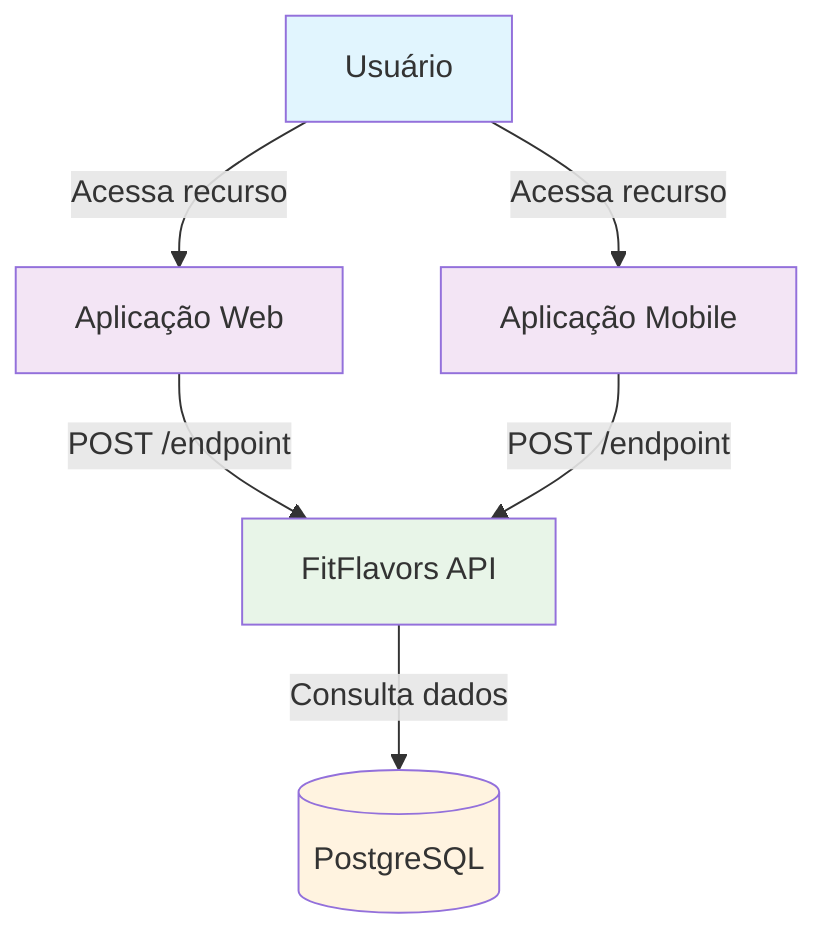
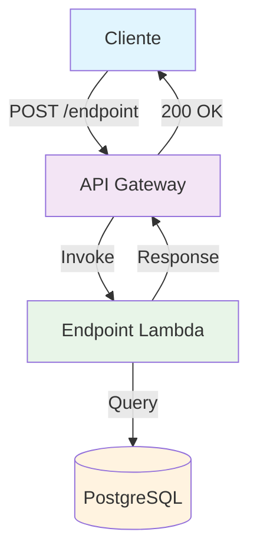
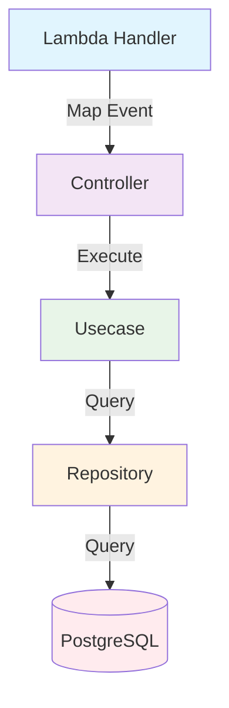

# C4 Model - [NOME_DO_ENDPOINT] Endpoint

## 🎯 Context (Nível 1)



**Descrição:** [Descrição detalhada do que o endpoint faz e qual problema resolve]

## 🏗️ Container (Nível 2)



**Componentes:**

- **API Gateway**: Recebe requisições HTTP e roteia para Lambda
- **Endpoint Lambda**: [Descrição do que a Lambda faz]
- **PostgreSQL**: [Descrição da interação com o banco]

## 🔧 Component (Nível 3)



**Fluxo de Execução:**

1. **Lambda Handler** mapeia evento API Gateway para HttpRequest
2. **Controller** recebe requisição e aplica validações
3. **Usecase** executa lógica de negócio
4. **Repository** consulta/persiste dados no banco

## 💻 Code (Nível 4)

### **Estrutura de Arquivos**

```
src/
├── infra/functions/
│   └── [nome].ts                          # Lambda Handler
├── domain/users/controllers/
│   └── [nome].controller.ts               # Controller
├── domain/users/usecases/
│   └── [nome].usecase.ts                  # Use Case
├── domain/users/repositories/
│   └── user.repository.ts                 # Repository Interface
├── infra/db/drizzle/repositories/
│   └── drizzle-user.repository.ts         # Repository Implementation
└── domain/users/dtos/
    ├── [nome]-request.dto.ts              # Request DTO
    └── [nome]-response.dto.ts             # Response DTO
```

### **Fluxo de Dados**

```
Cliente → API Gateway → Lambda Handler → Controller → Usecase → Repository → Database
                ↑                                                                    ↓
                ← Response ← Response ← Response ← Response ← Response ← Response ←
```

### **Validações**

```typescript
const schema = z.object({
  // [Definir schema de validação]
  field1: z.string().min(1),
  field2: z.email(),
  field3: z.number().positive(),
});
```

### **Request Body**

```typescript
{
  // [Definir estrutura do request]
  "field1": "string",
  "field2": "email@example.com",
  "field3": 123
}
```

### **Response de Sucesso**

```typescript
{
  // [Definir estrutura da resposta de sucesso]
  "data": {
    "id": "user-123",
    "field1": "value1"
  }
}
```

### **Response de Erro**

```typescript
{
  "error": "[Tipo do erro]",
  "message": "[Descrição do erro]"
}
```

### **Tratamento de Erros**

- **400 Bad Request**: Dados de validação inválidos
- **401 Unauthorized**: Token JWT inválido ou expirado
- **403 Forbidden**: Usuário sem permissão
- **404 Not Found**: Recurso não encontrado
- **409 Conflict**: Conflito de dados
- **500 Internal Server Error**: Erro interno do servidor

## 📊 Métricas e Monitoramento

### **Métricas de Sucesso**

- Taxa de [ação] bem-sucedida
- Tempo de resposta do endpoint
- Uso de memória da Lambda
- [Métricas específicas do endpoint]

### **Métricas de Erro**

- Taxa de validação falhada
- Taxa de [erros específicos]
- Erros de banco de dados
- [Outras métricas de erro]

### **Métricas de Segurança**

- Tentativas de acesso não autorizado
- Taxa de tokens inválidos
- [Métricas de segurança específicas]

### **Logs Importantes**

- Tentativas de [ação] (sucesso/falha)
- Erros de validação
- [Logs específicos do endpoint]
- Problemas de conectividade com banco

## 🔒 Considerações de Segurança

- **Validação rigorosa** de dados de entrada
- **Autenticação** (se aplicável)
- **Autorização** (se aplicável)
- **Rate limiting** para prevenir abuso
- **Logs de auditoria** para [ação]
- **Não exposição** de dados sensíveis

## 🚀 Melhorias Futuras

1. **[Melhoria 1]**
2. **[Melhoria 2]**
3. **[Melhoria 3]**
4. **[Melhoria 4]**
5. **[Melhoria 5]**

## 📝 Checklist de Implementação

### **Desenvolvimento**

- [ ] Criar Lambda Handler
- [ ] Implementar Controller
- [ ] Implementar Use Case
- [ ] Criar DTOs (Request/Response)
- [ ] Implementar validações
- [ ] Adicionar tratamento de erros

### **Testes**

- [ ] Testes unitários para Use Case
- [ ] Testes de integração para Controller
- [ ] Testes de validação
- [ ] Testes de tratamento de erros

### **Deploy**

- [ ] Configurar no serverless.yml
- [ ] Configurar autorização (se necessário)
- [ ] Configurar variáveis de ambiente
- [ ] Testar em ambiente de desenvolvimento

### **Monitoramento**

- [ ] Configurar métricas de CloudWatch
- [ ] Configurar alertas
- [ ] Implementar logs estruturados
- [ ] Documentar métricas de negócio

---

**Nota:** Substitua todos os placeholders `[NOME]`, `[ENDPOINT]`, `[MÉTODO]`, etc. pelos valores específicos do seu endpoint.
